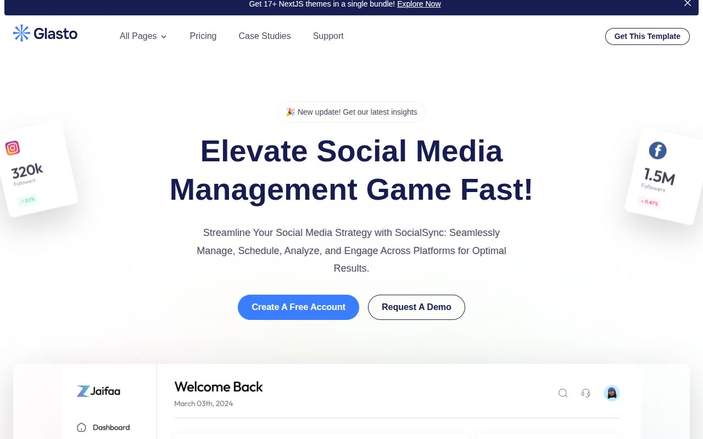

# Glasto — SaaS & Startup Website Template Clone (Vanilla HTML + CSS + JS)

[](./demo.mp4)

Glasto is a 16-page SaaS and startup marketing website template, faithfully rebuilt from the original ThemeFisher Next.js design as plain HTML, CSS, and vanilla JavaScript — no build step, no framework, no dependencies to install. The template showcases "SocialSync", a social media management platform, and covers the full range of pages a real SaaS product site needs: home, pricing, company, integrations, case studies, blog, reviews, changelog, contact, demo request, legal pages, a 404 page, and a UI elements showcase. The visual style pairs bold blue (`#3a7dff`) against deep navy (`#161c52`) on a clean white background, with the Onest typeface from Google Fonts and interactions powered by Swiper.js carousels and AOS scroll-entrance animations. Generated with Claude Fable 5.

## Pages

| File | Page |
|---|---|
| `index.html` | Home |
| `pricing.html` | Pricing |
| `company.html` | Company |
| `integration.html` | Integrations |
| `case-studies.html` | Case Studies |
| `case-study.html` | Case Study Detail |
| `contact.html` | Contact |
| `demo.html` | Request a Demo |
| `changelog.html` | Changelog |
| `blog.html` | Blog |
| `blog-post.html` | Blog Post |
| `reviews.html` | Reviews |
| `privacy-policy.html` | Privacy Policy |
| `terms-conditions.html` | Terms & Conditions |
| `404.html` | 404 |
| `elements.html` | UI Elements |

## Features

- Sticky header with scroll-activated background and shadow
- Mobile hamburger navigation with full-width expanded menu
- "All Pages" mega-dropdown (3-column with descriptions)
- Dismissable announcement bar (state saved to `localStorage`)
- Marquee logo strip and stats strip (CSS infinite scroll)
- Swiper.js testimonial and logo carousels
- AOS (Animate On Scroll) entrance animations site-wide
- FAQ accordion with smooth height animation
- Pricing toggle — monthly / yearly switcher
- Feature tabs with associated screenshots
- All assets vendored locally in `assets/` — runs fully offline

## Run

No build step required. Open `index.html` directly in a browser:

```sh
# Option 1 — open directly
open index.html

# Option 2 — serve locally (recommended, avoids any CORS quirks)
python3 -m http.server
# then visit http://localhost:8000
```

`prompt.md` holds the full build specification and `demo.mp4` shows the template in motion.

## Credits

Faithful clone of an existing design, recreated for study/learning. All credit for the original design goes to its creators.

**Original:** ThemeFisher — https://themefisher.com/demo?theme=glasto-nextjs

---

Part of the [Templates](../) collection in the [claude-directory](../../../) — an open-source gallery of AI-generated UI built with Claude Fable 5. [Browse the live gallery](https://pulkitxm.com/claude-directory).
