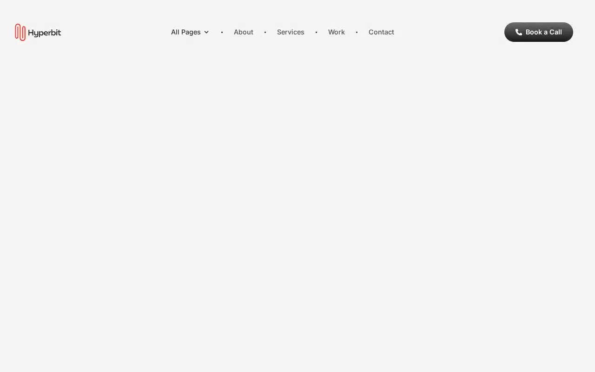

# Hyperbit — Digital Agency Website Template Clone (Vanilla HTML + CSS + JS)

[](./demo.mp4)

Hyperbit is a modern digital agency website template, faithfully reproduced as plain HTML, CSS, and vanilla JavaScript with no build step required. The design features a light-gray body with dark gradient buttons, colorful gradient blobs in the hero, a CSS custom-property color system, smooth Lenis scrolling, IntersectionObserver scroll-reveal entrance animations, a testimonials carousel, FAQ accordion, animated marquee client logos, and a full pricing section — everything you would expect from a polished agency template. Typography combines Inter (300–600 weight) for UI and body copy with Instrument Serif italic for decorative heading emphasis. Generated with Claude Fable 5.

## Pages

| File | Page |
|---|---|
| `index.html` | Home |
| `about.html` | About |
| `services.html` | Services |
| `work.html` | Work |
| `contact.html` | Contact |
| `blog.html` | Blog |
| `blog/emerging-trends.html` | Blog Detail |
| `work/spark-layer.html` | Work Detail |

## Run

No build step is required. Open any page directly in a browser:

```
open index.html
```

Or serve the folder with Python's built-in HTTP server so that relative paths resolve correctly:

```sh
python3 -m http.server
```

Then visit `http://localhost:8000` in your browser.

## Key Features

- **Smooth scrolling** — Lenis scroll library loaded from CDN
- **Scroll reveals** — IntersectionObserver drives entrance animations on every section
- **Sticky header** — nav locks to the top and gains a background on scroll
- **Dropdown nav** — opacity + translate-Y transition on desktop hover
- **Hero** — badge dot, gradient blobs, grid overlay, service tag pills, dual CTA buttons
- **Testimonials carousel** — four reviews with auto-advance
- **Pricing cards** — two tiers (Team/Startup and Enterprise) with feature lists
- **FAQ accordion** — icon rotates 90 deg, panel height animates via `max-height`
- **Animated marquee** — six client logos scroll continuously
- **Contact form** — name, email, phone, services dropdown, message
- **CSS custom properties** — full palette (`--color-primary`, `--color-secondary`, gradients, radii) defined in `:root`
- **Mobile responsive** — fluid type scale (desktop 16 px / mobile 12.8 px base) and stacked layouts

## Project Spec

`prompt.md` in this folder holds the complete build specification. `demo.mp4` shows the template in motion.

## Credits

Faithful clone of an existing design, recreated for study/learning. All credit for the original design goes to its creators.

**Original:** Themefisher — https://themefisher.com/demo?theme=hyperbit-nextjs

---

Part of the [Templates](../../) collection in the [claude-directory](../../../../) — an open-source gallery of AI-generated UI built with Claude Fable 5. [Browse the live gallery](https://pulkitxm.com/claude-directory).
