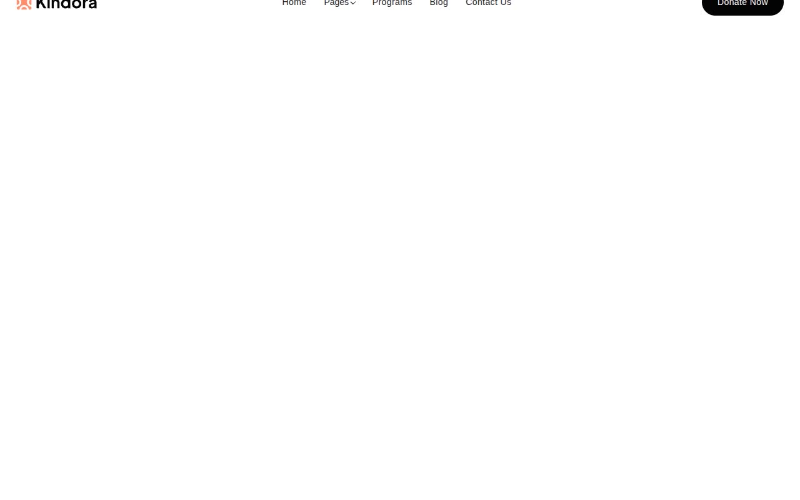

# Kindora — Charity & Non-Profit Website Template Clone (Vanilla HTML/CSS/JS)

[](./demo.mp4)

A pixel-faithful clone of the ThemeFisher Kindora NextJS charity and non-profit website template, rebuilt as a fully self-contained static site with no build step required. The template spans ten pages — Home, About, Programs, Blog, Teams, Reviews, Contact, Donation, and 404 — each sharing a common design system of warm coral (`#FB8E6D`), bright green (`#52DB83`), and golden yellow (`#FFC700`) accent colors on an Urbanist typeface. Standout techniques include a CSS-only infinite brand marquee, AOS scroll-entrance animations, a Swiper.js testimonials carousel, a JS-powered FAQ accordion, sticky/blur reveal header, and color-cycling metric cards. Built with plain HTML, CSS custom properties, and vanilla JavaScript — no framework, no bundler. Generated with Claude Fable 5.

## Run

No installation required. Open any HTML file directly in a browser, or serve the folder with any static file server:

```sh
# Option A — Python (built-in)
python3 -m http.server 8080
# then open http://localhost:8080

# Option B — Node (npx)
npx serve .
```

All pages link to each other via relative paths. CDN dependencies (Google Fonts, AOS, Swiper) require an internet connection.

## Pages

| File | Page |
|---|---|
| `index.html` | Home |
| `about.html` | About Us |
| `programs.html` | Programs |
| `blog.html` | Blog |
| `teams.html` | Team |
| `reviews.html` | Reviews |
| `contact.html` | Contact |
| `donation.html` | Donation |
| `404.html` | 404 Not Found |

## Stack

- **HTML5** — semantic markup (`<header>`, `<nav>`, `<main>`, `<section>`, `<footer>`, `<article>`)
- **CSS** — design tokens in `tokens.css`, component styles in `styles.css`, Bootstrap-compatible 12-column grid
- **Vanilla JavaScript** — inline per page: AOS init, scroll header-reveal, hamburger toggle, dropdown nav, FAQ accordion, Swiper init
- **AOS 2.3.4** (CDN) — scroll entrance animations (`fade-up-sm`, `fade-left`, `fade-right`)
- **Swiper 11** (CDN) — testimonials carousel with autoplay, loop, and navigation
- **Google Fonts** — Urbanist (400, 600, 700)

The full build spec is in `prompt.md`; `demo.mp4` shows the complete site in motion.

## Credits

Faithful clone of an existing design. Original: ThemeFisher — https://themefisher.com/demo?theme=kindora-nextjs

---

Part of the [Templates](../) collection in the [claude-directory](../../) — an open-source gallery of AI-generated UI built with Claude Fable 5. [Browse the live gallery](https://pulkitxm.com/claude-directory).
