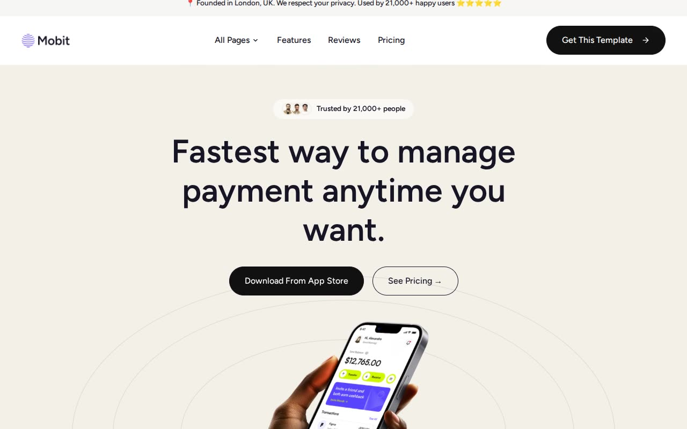

# Mobit — Themefisher Next.js Fintech App Landing Page Clone (Vanilla HTML/CSS/JS)

[](./demo.mp4)

Mobit is a pixel-faithful, offline-runnable reproduction of the "Mobit" Next.js finance/payments-app marketing template by Themefisher, rebuilt as plain HTML, CSS, and vanilla JS with no build step and no framework runtime. It's a clean, light, warm-beige fintech landing site styled with Tailwind-derived design tokens (`--color-primary`, `--color-secondary`, `--color-homepage-hero`, etc.), Figtree as the single typeface, and AOS (Animate On Scroll) for the same fade-up scroll-reveal animations as the source. The clone reproduces all 25 pages discovered on the live template — home, features, pricing, reviews, contact, a 3-page paginated blog index, 13 individual blog post pages, a full "elements" UI style-guide/kitchen-sink page, privacy policy, terms & conditions, and a 404 page — plus every shared interaction: the CSS-checkbox mobile hamburger menu, the hover-opening "All Pages" dropdown nav, the click-to-expand FAQ/elements accordion, the pricing monthly/yearly toggle, the elements-page tabs, the auto-scrolling testimonial marquee, and button/link hover states. Generated with Claude Fable 5.

## Run

This project has no build step — it ships as static HTML/CSS/JS. Serve the folder with any static file server, e.g.:

```sh
python3 -m http.server
```

then open `http://localhost:8000/index.html` (or open `index.html` directly in a browser).

### Regenerating pages (authoring-time only)

Each page's HTML is assembled from shared `_partials/header.html`, `_partials/footer.html`, and `_partials/cta-band.html`, plus a per-page fragment in `_content/`, driven by `_pages.json`. Reusable data-driven blocks (integrations grid, testimonial marquee, pricing cards, FAQ accordion, blog card grids, pagination, related-post cards) are generated by `_build.mjs` itself. This is only needed if you edit a partial, a content fragment, or the generator — the output pages are plain static HTML and require no build to serve:

```sh
node _build.mjs
```

## Verify

The full build spec — palette tokens, typography, page-by-page layout, and every interaction to reproduce — is documented in `prompt.md`. `demo.mp4` shows the home page in motion (scroll-reveal animations, hover states, FAQ accordion, pricing toggle).

## Credits

Faithful clone of an existing design, recreated for study/learning. All credit for the original design goes to its creators.

**Original:** Themefisher (Mobit Next.js template) — <https://themefisher.com/demo?theme=mobit-nextjs>

---

Part of the [Templates](../../../) collection in the [claude-directory](../../../../) — an open-source gallery of AI-generated UI built with Claude Fable 5. [Browse the live gallery](https://pulkitxm.com/claude-directory).
