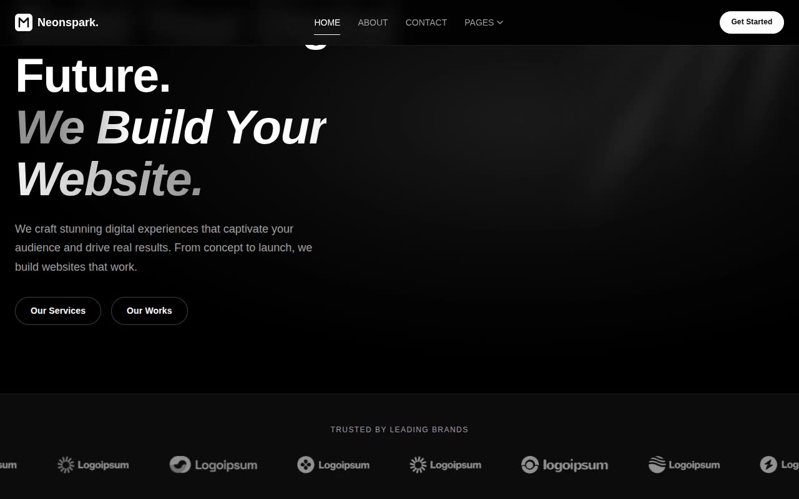

# NeonSpark — Dark Agency / SaaS Landing Page Template Clone (Vanilla HTML + CSS + JS)

[](./demo.mp4)

Pixel-faithful clone of the NeonSpark NextJS template by Themefisher, reproduced as plain HTML, CSS, and vanilla JavaScript with no build step required. The template is a dark-theme digital agency and SaaS landing page featuring an all-black aesthetic (`#0c0c0c` body), subtle neon glow effects, scroll-triggered entrance animations via `IntersectionObserver`, a continuous marquee ticker, rotating conic-gradient card borders, and typographic headings that mix regular and italic weights using the Epilogue typeface. Fifteen fully-linked pages cover every section of the original: home, about, blog, blog post, career, contact, elements/design-system showcase, FAQ, pricing, privacy policy, services, service detail, teams, terms and conditions, and work. Generated with Claude Fable 5.

## Pages

| File | Page |
|------|------|
| `index.html` | Home — hero, features, how-we-work, services tabs, testimonials, recent projects, CTA |
| `about.html` | About — mission, who-we-are, count-up stats, testimonials |
| `blog.html` | Blog — featured posts grid, latest posts, pagination |
| `blog-post.html` | Blog Post — article body, blockquotes, code blocks, sidebar |
| `career.html` | Career — office photos, values, perks, job listings |
| `contact.html` | Contact — project-request form, two office cards |
| `elements.html` | Elements — full design-system component showcase |
| `faq.html` | FAQ — categorised accordion (General, Pricing, Technical) |
| `pricing.html` | Pricing — monthly/yearly toggle, Professional and Enterprise cards |
| `privacy-policy.html` | Privacy Policy — long-form legal text |
| `service-detail.html` | Service Detail — deliverables list, related services |
| `services.html` | Services — vertical tab panel, stats row, contact form |
| `teams.html` | Teams — 4-column member grid with hover overlay |
| `terms-and-condition.html` | Terms and Condition — long-form legal text |
| `work.html` | Work — project gallery grid (project-1 through project-9) |

## Run

No build step is required. Open `index.html` directly in a browser, or serve the folder over HTTP to avoid any asset-path issues:

```sh
python3 -m http.server 8080
```

Then visit `http://localhost:8080` in your browser.

## Notable techniques

- **Scroll reveals** — `IntersectionObserver` transitions elements from `opacity: 0; transform: translateY(30px)` to `opacity: 1; transform: translateY(0)` over `0.6s ease`.
- **Marquee ticker** — `@keyframes marquee` runs a continuous `translate(0) → translate(-100%)` loop at `20s linear infinite`.
- **Rotating gradient border** — `@keyframes rotateBorder` animates `--gradient-angle` from `0deg` to `360deg` on a conic-gradient border to produce the neon card-border effect.
- **Glow pulse** — `@keyframes glowPulse` cycles a `drop-shadow` filter on the hero light orbs.
- **Count-up animation** — counters on the About and Services pages animate from zero to their target value on scroll entry.
- **Epilogue typeface** — loaded from Google Fonts at weights 400, 500, 600, and 700; headings combine upright and italic cuts for the signature mixed-weight style.
- **Pill navbar** — desktop header has `border-radius: 9999px`, fixed on scroll with a backdrop-blur.

`prompt.md` holds the full build specification.

## Credits

Faithful clone of an existing design, recreated for study/learning. All credit for the original design goes to its creators.

**Original:** Themefisher — <https://themefisher.com/demo?theme=neonspark-nextjs>

---

Part of the [Templates](../) collection in the [claude-directory](../../../../) — an open-source gallery of AI-generated UI built with Claude Fable 5. [Browse the live gallery](https://pulkitxm.com/claude-directory).
