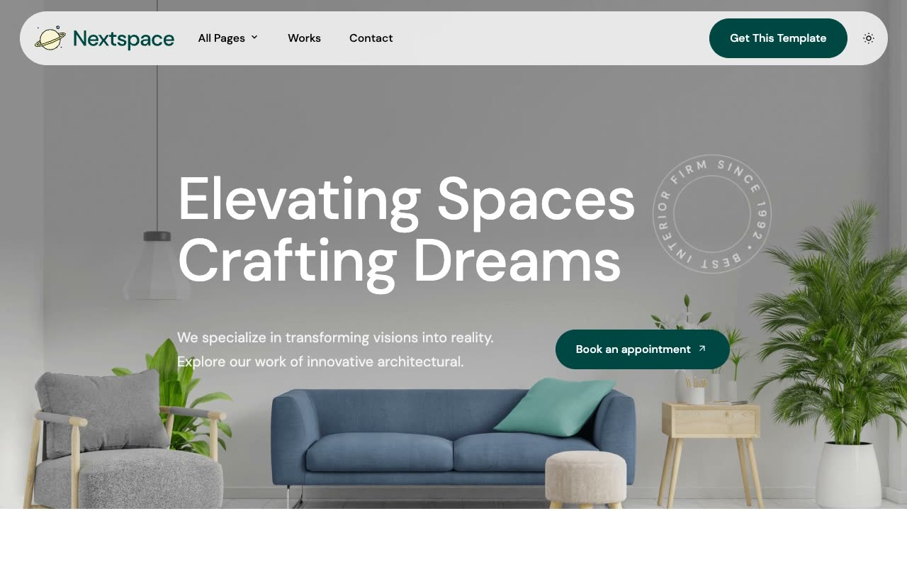

# NextSpace — Interior Design & Architecture Studio Landing Page Clone (Vanilla HTML/CSS/JS)

[](./demo.mp4)

NextSpace is an editorial-style marketing template for an interior-design/architecture studio, rebuilt pixel-faithfully as a self-contained, multi-page static clone with no framework and no build step. It pairs a deep teal primary color with a cream secondary accent on a white base, set in DM Sans typography, with a floating pill-shaped translucent navbar, scroll-triggered fade/slide-up section reveals, hover-state image zoom and lift on project/blog cards, and fill/color-swap button hover transitions — including a light/dark theme toggle (persisted to `localStorage`, honoring `prefers-color-scheme`) that was added for this clone since the source template only ships a light theme. All fonts, images, and other assets are vendored locally, with no external hotlinking.

## Pages

Home, About, Services, Projects listing plus 7 project detail pages, Blog listing (paginated) plus 6 blog post detail pages, Reviews, FAQs, Gallery, Contact, Career, Elements (UI kit/style-guide showcase), Terms and Conditions, Privacy Policy, and a custom 404 page. All pages share the same floating pill header/navbar and multi-column footer chrome.

## Run

This is plain HTML/CSS/vanilla JS — there is no `package.json` and no build step. Open `index.html` directly in a browser, or serve the folder with any static file server from the project root:

```sh
python3 -m http.server
```

Then open `http://localhost:8000/` (or navigate to any page, e.g. `http://localhost:8000/about.html`, `http://localhost:8000/projects/project-1.html`, `http://localhost:8000/blog/post-1.html`).

## Notes

- `prompt.md` contains the full build spec — color tokens, typography scale, motion/animation details, and the complete page-by-page layout breakdown used to build this clone.
- `demo.mp4` (with `poster.jpg` as its thumbnail) shows the site in motion, including scroll-reveal animations and the theme toggle.
- Assets (fonts, images, CSS, JS) live under `assets/`, `css/`, and `js/`, all vendored locally rather than hotlinked from the source.

## Credits

Faithful clone of an existing design, recreated for study/learning. All credit for the original design goes to its creators.

**Original:** Themefisher — <https://themefisher.com/demo?theme=nextspace-nextjs>

---

Part of the [Templates](../) collection in the [claude-directory](../../) — an open-source gallery of UI templates. [Browse the live gallery](https://pulkitxm.com/claude-directory).
