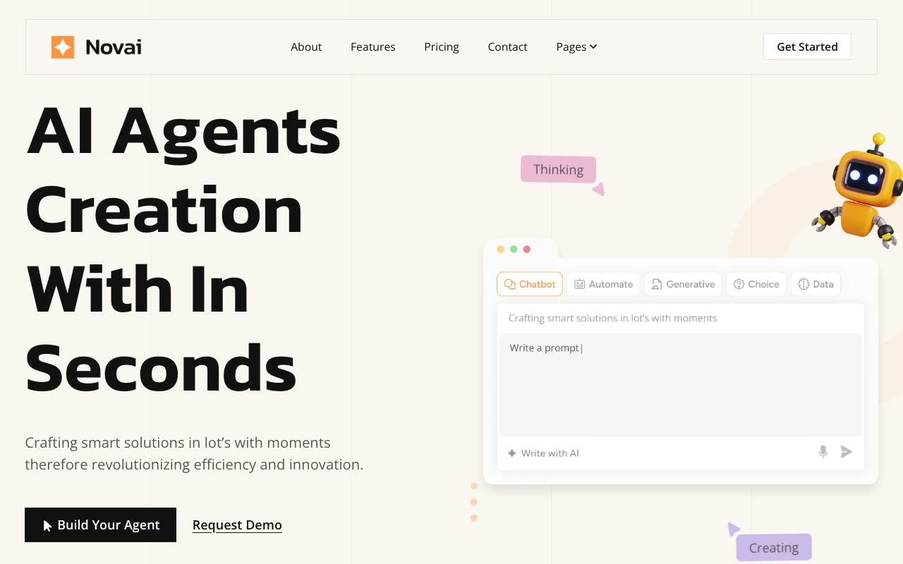

# Novai — AI Agent / SaaS Marketing Template Clone (Vanilla HTML/CSS/JS)

[](./demo.mp4)

Novai is a light-theme AI-agent/SaaS marketing template for an "AI agent creation" product, rebuilt pixel-faithfully as a 17-page, self-contained static clone with no framework and no build step. It reproduces the warm off-white base palette with a bold orange accent and near-black contrast sections (hero stats bar, testimonials band), Open Sans body type paired with Kanit display accents, AOS-driven scroll-reveal fade/slide animations, a header that becomes a floating "sticky" pill on scroll, a max-height/opacity FAQ accordion, and hover-state transitions on cards, buttons, and nav links.

## Pages

Home, About, Features (overview grid) plus a shared feature-detail template, Pricing (with monthly/yearly toggle and Starter/Growth/Pro/Enterprise tiers), Integrations, Case Studies index plus a shared case-study template, Blog index plus a shared blog-post template, Careers, Contact, FAQs (accordion), Elements (UI component showcase), Privacy Policy, Terms & Conditions, and a custom 404 page. All pages share the same persistent header (logo, About/Features/Pricing/Contact links, a "Pages" dropdown, and a "Get Started" CTA) and footer (blurb, Quick Links, Support links, newsletter signup, social icons).

## Run

This is plain HTML/CSS/vanilla JS — there is no `package.json` and no build step. Serve the folder with any static file server from the project root:

```sh
python3 -m http.server
```

Then open `http://localhost:8000/` (or `index.html` directly) in a browser.

## Notes

- `prompt.md` contains the full build spec — color tokens, typography scale, motion/animation details, and the complete page-by-page layout breakdown used to build this clone.
- `demo.mp4` (with `poster.jpg` as its thumbnail) shows the site in motion, including the sticky header pill, scroll-reveal animations, and the FAQ accordion.
- Repeating content types (blog posts, case studies, individual feature pages) are built once as shared, faithful template pages rather than duplicated per slug, matching the pattern used by sibling `templates/premium/themefisher/*` clones.

## Credits

Faithful clone of an existing design, recreated for study/learning. All credit for the original design goes to its creators.

**Original:** Themefisher — <https://themefisher.com/demo?theme=novai-nextjs>

---

Part of the [Templates](../) collection in the [claude-directory](../../) — an open-source gallery of UI experiments. [Browse the live gallery](https://pulkitxm.com/claude-directory).
