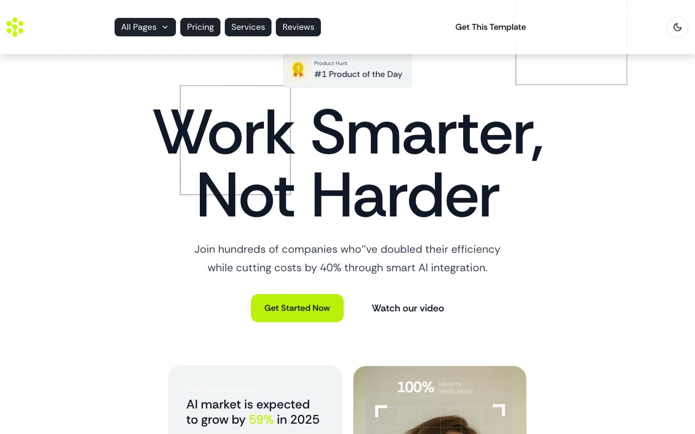

# Optivus — AI SaaS Product Landing Page Template Clone (Vanilla HTML/CSS/JS)

[](./demo.mp4)

Optivus is a dark-theme AI/SaaS product marketing template built around the headline "Work Smarter, Not Harder," rebuilt pixel-faithfully as a 19-page, self-contained static clone with no framework and no build step. It reproduces the near-black `#111721` base palette with a neon lime-green `#bbf10a` accent, "Rethink Sans" typography, hover-lift card transitions, single-open FAQ/process accordions, a sticky shrink-on-scroll header, and scroll-triggered reveal animations — including a light/dark theme toggle (persisted to `localStorage`, honoring `prefers-color-scheme`) that was added for this clone since the source template only ships dark mode.

## Pages

Home (hero, industries grid, technology showcase, process accordion, testimonials, blog preview, FAQ, CTA band), Blog index with pagination plus 3 full blog post templates, Contact, two About page variants, an Elements style-guide page, Reviews, Services, Team, How It Works, two Pricing variants (monthly/yearly toggle plus a feature-comparison table), Terms & Conditions, Terms of Service, Privacy Policy, and a custom 404 page. All pages share the same header/footer chrome and design tokens.

## Run

This is plain HTML/CSS/vanilla JS — there is no `package.json` and no build step. Serve the folder with any static file server from the project root:

```sh
python3 -m http.server
```

Then open `http://localhost:8000/` (or `index.html` directly) in a browser.

## Notes

- `prompt.md` contains the full build spec — color tokens, typography scale, motion details, and the complete page-by-page layout breakdown used to build this clone.
- `demo.mp4` (with `poster.jpg` as its thumbnail) shows the site in motion, including hover states and scroll-reveal animations.
- Assets (fonts, images, CSS, JS) live under `assets/`.

## Credits

Faithful clone of an existing design, recreated for study/learning. All credit for the original design goes to its creators.

**Original:** Themefisher — Optivus (Next.js) — <https://themefisher.com/demo?theme=optivus-nextjs>

---

Part of the [Templates](../) collection in the [claude-directory](../../) — an open-source gallery of UI templates. [Browse the live gallery](https://pulkitxm.com/claude-directory).
