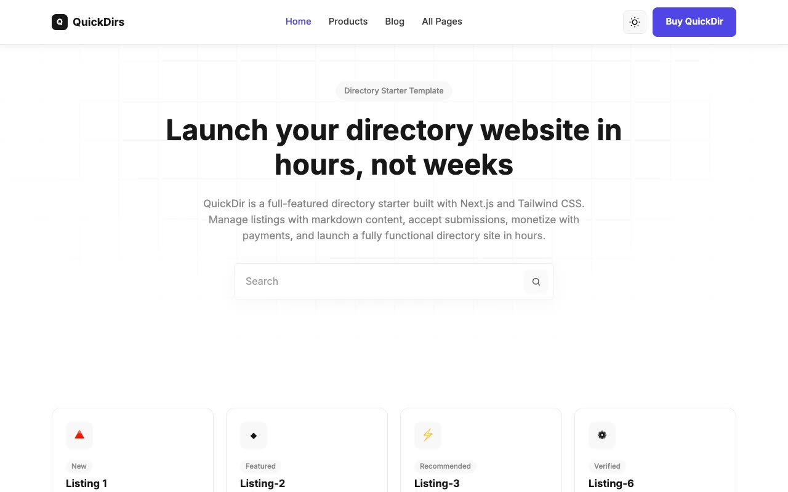

# QuickDir — Directory & Product Listing SaaS Template Clone (Vanilla HTML/CSS/JS)

[](./demo.mp4)

QuickDir is a directory / product-listing marketing template — think a Product-Hunt-style tools directory — rebuilt as a pixel-faithful, self-contained 14-page static clone with no framework and no build step. It reproduces the shadcn/Tailwind-style design token system (background/foreground/card/border/accent/destructive CSS custom properties), Inter typography, card-based product listings with logos, badges and upvote counts, a monthly/yearly pricing toggle, category filter chips, a mobile hamburger menu, and hover-state border/shadow/color transitions plus fade/slide scroll-reveal animations on section entry. Light mode is the default theme; a light/dark toggle was added for this clone, wired to `:root` and `[data-theme="dark"]`, honoring `prefers-color-scheme` and persisting the choice via `localStorage`.

## Pages

Home (`index.html`), About, Authors, Blog, Changelog, Contact, Docs, Pricing, Privacy Policy, Products (directory grid with filters), Product listing detail (`products/listing-1.html`), Submit, Terms & Conditions, and a custom 404 page — 14 pages in total, all sharing the same sticky navbar and multi-column footer chrome.

## Run

This is plain HTML/CSS/vanilla JS — there is no `package.json` and no build step. Serve the folder with any static file server from the project root:

```sh
python3 -m http.server 8000
```

Then open `http://localhost:8000/index.html` in a browser.

## Notes

- `prompt.md` contains the full build spec — color tokens (light and dark), typography scale, spacing/radius/transition values, and the complete page-by-page layout breakdown used to build this clone.
- `demo.mp4` (with `poster.jpg` as its thumbnail) shows the site in motion, including the theme toggle, scroll-reveal animations, and the pricing toggle.
- Shared assets (fonts, images, CSS, JS) live under `assets/`.

## Credits

Faithful clone of an existing design, recreated for study/learning. All credit for the original design goes to its creators.

**Original:** Themefisher — QuickDir Next.js Template — <https://themefisher.com/demo?theme=quickdir-nextjs>

---

Part of the [Templates](../) collection in the [claude-directory](../../) — an open-source gallery of AI-generated UI built with Claude Fable 5. [Browse the live gallery](https://pulkitxm.com/claude-directory).
