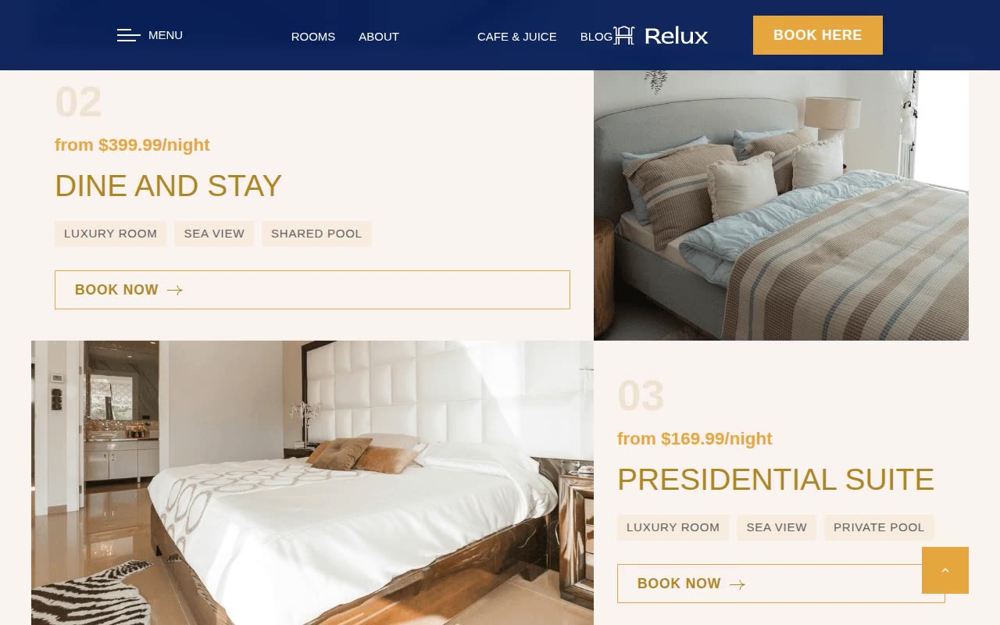

# Relux — Luxury Hotel Template Clone

[](./demo.mp4)

A pixel-faithful, self-contained HTML/CSS/vanilla-JS clone of the **Relux Next.js** luxury hotel template by [Themefisher](https://themefisher.com). Every page, hover state, scroll-entrance animation, gallery lightbox, testimonial slider, and responsive layout has been reproduced without any build step — open an HTML file and it works.

## Overview

Relux is a premium multi-page hotel website template featuring an elegant warm palette (gold `#e5a63f`, deep navy `#051c56`, warm cream `#f9f3f0`), serif headings in Namdhinggo, sans-serif body copy in Red Rose, a full-screen parallax hero banner, smooth scroll-reveal entrance animations, and a rich set of interactive components.

This clone faithfully reproduces:

- **17 HTML pages** — home, rooms listing, 5 room detail pages, about, cafe & juice, blog listing, 5 blog post pages, contact, and privacy policy
- **Shared design system** — CSS custom properties for all colors, typography scale, spacing, radii, and easings in `styles.css`
- **Interactive components** — testimonial slider, gallery lightbox, sticky/scrolled header, mobile hamburger nav overlay, back-to-top button, and scroll-reveal IntersectionObserver animations
- **Locally vendored assets** — all images, fonts (via Google Fonts CDN), and icons are self-contained; no external asset requests beyond Google Fonts

## Pages

| Page | File |
|------|------|
| Home | `index.html` |
| Rooms Listing | `rooms.html` |
| Deluxe Suite | `room-deluxe-suite.html` |
| Dine and Stay | `room-dine-and-stay.html` |
| Presidential Suite | `room-presidential-suite.html` |
| The Horizon Suite | `room-the-horizon-suite.html` |
| The View Suite | `room-the-view-suite.html` |
| About | `about.html` |
| Cafe & Juice | `cafe-juice.html` |
| Blog | `blog.html` |
| Guest Stories (post) | `blog-guest-stories.html` |
| Luxury Lifestyle (post) | `blog-luxury-lifestyle.html` |
| Suites & Stays (post) | `blog-suites-stays.html` |
| Travel Inspiration (post) | `blog-travel-inspiration.html` |
| Wellness & Spa (post) | `blog-wellness-spa.html` |
| Contact | `contact.html` |
| Privacy Policy | `privacy-policy.html` |

## Design Tokens

- **Primary (gold):** `#e5a63f`
- **Secondary (navy):** `#051c56`
- **Light background:** `#f9f3f0`
- **Heading font:** Namdhinggo (Google Fonts)
- **Body font:** Red Rose (Google Fonts)
- **Animations:** fade-up, fade-down, fade-right, fade-left — all driven by IntersectionObserver with CSS keyframes

## Running Locally

No build step required. Open any `.html` file directly in a browser, or serve the folder:

```bash
# From the project folder
python3 -m http.server 8080
# Then open http://localhost:8080
```

## Verifying the Demo

```bash
# Confirm demo.mp4 exists and is valid
ffprobe demo.mp4 2>&1 | grep "Video:"

# View poster
open poster.jpg
```

## Project Structure

```
relux-nextjs/
├── index.html              # Home page
├── rooms.html              # Rooms listing
├── room-*.html             # 5 room detail pages
├── about.html
├── cafe-juice.html
├── blog.html               # Blog listing
├── blog-*.html             # 5 blog post pages
├── contact.html
├── privacy-policy.html
├── styles.css              # Shared design system + all component styles
├── script.js               # Shared JS: nav, slider, lightbox, scroll-reveal
├── assets/
│   └── images/             # All images vendored locally
├── .reference/             # Captured reference screenshots + computed styles
├── demo.mp4
└── poster.jpg
```

## Credits

Faithful clone of an existing design, recreated for study/learning. All credit for the original design goes to its creators.

**Original:** Themefisher — <https://themefisher.com/demo?theme=relux-nextjs>

---

Browse more premium template clones: [Themefisher templates](../) | [All templates](../../) | [Fable gallery](../../../)
