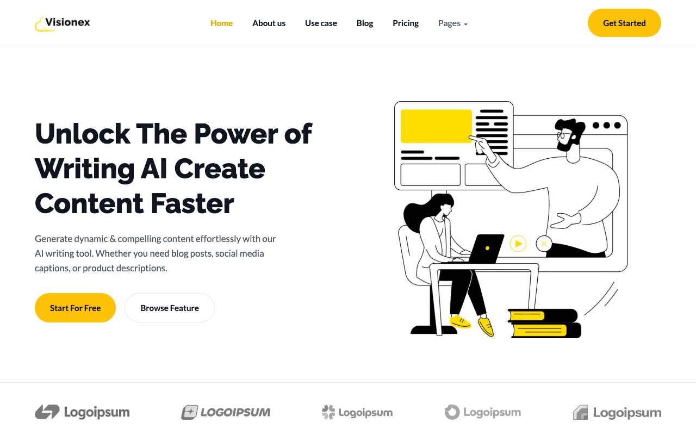

# Visionex — AI Writing Assistant SaaS Template

[](./demo.mp4)

Pixel-faithful reproduction of the Visionex Next.js AI-writing SaaS template by ThemeFisher, rebuilt as a self-contained plain HTML/CSS/JS project with no build step required. The design uses a bold yellow-and-near-black palette (`#FFC107` accent, `#0E1420` dark), flat line-art illustrations, pill-shaped buttons, and rounded cards. Raleway drives headings and Lato handles body copy. The project ships 16 complete pages — home, about us, use case, blog listing plus 6 blog post detail pages, pricing, our team, FAQ, contact us, career, and a 404 — all sharing a single `assets/css/tokens.css` + `assets/css/styles.css` design system and `assets/js/main.js`.

## Run

No build step required. Open any page directly in a browser:

```
open index.html
```

Or serve the folder over HTTP (recommended, so relative paths resolve correctly):

```sh
cd templates/premium/themefisher/visionex-nextjs
python3 -m http.server
# then visit http://localhost:8000
```

## Pages

| File | Page |
|---|---|
| `index.html` | Home |
| `about-us.html` | About Us |
| `use-case.html` | Use Case |
| `blog.html` | Blog |
| `blog-post-1.html` – `blog-post-6.html` | Blog Post Detail |
| `pricing.html` | Pricing |
| `our-team.html` | Our Team |
| `faq.html` | FAQ |
| `contact-us.html` | Contact Us |
| `career.html` | Career |
| `404.html` | Not Found |

## Notable techniques

- **CSS custom properties design system** — `assets/css/tokens.css` defines color, radius, font, and easing tokens once, with light and dark variants (`:root` + `prefers-color-scheme: dark` + `:root.dark`), consumed across all 16 pages by `assets/css/styles.css`.
- **Feature tabs** — the "Generate content using AI" section swaps an illustration based on the selected feature tab.
- **Step pills** — the "Few Steps To Write Content" section is driven by a pill tab bar.
- **Pricing monthly/yearly toggle** — a switch rewrites every plan card's price and period label via JavaScript, on both the home page and the dedicated pricing page.
- **FAQ accordion** — collapsible answer panels with CSS `max-height` transitions; only one item stays open at a time.
- **Scroll-reveal animation** — sections fade/slide into view via `IntersectionObserver`, with a timed fallback so content is never left invisible.
- **Mobile hamburger nav** — a three-bar toggle reveals a stacked mobile nav panel, with a tap-to-expand "Pages" dropdown, beneath the sticky header.
- **Feature comparison table** — `pricing.html` renders a responsive, horizontally-scrollable plan comparison table.

`prompt.md` holds the full visual specification and `demo.mp4` shows the template in motion.

## Tech stack

- Vanilla HTML5, CSS3, JavaScript (ES6+) — zero dependencies, zero build step
- [Raleway](https://fonts.google.com/specimen/Raleway) — heading font, vendored locally
- [Lato](https://fonts.google.com/specimen/Lato) — body font, vendored locally
- All images vendored locally under `assets/images/`

## Credits

This is a study/clone of an existing design, built for learning purposes. All credit for the original design goes to its creators.

**Original:** Themefisher — <https://themefisher.com/demo?theme=visionex-nextjs>
