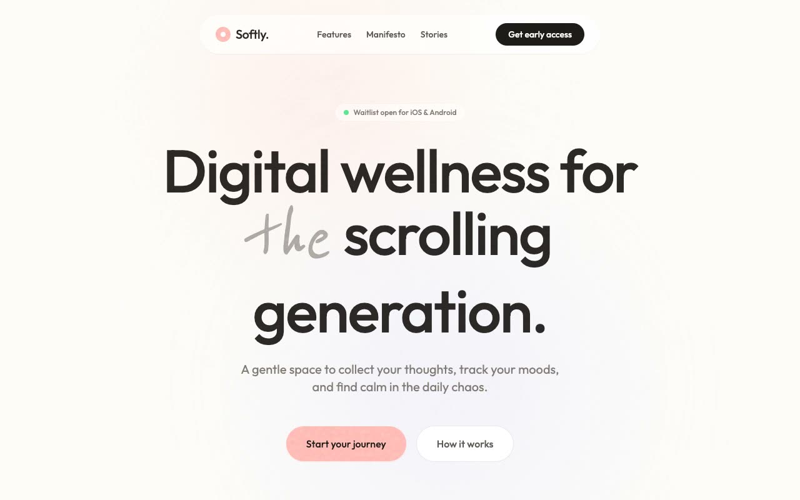

# Softly — Digital Wellness App Landing Page (HTML, Tailwind CSS, Outfit, Reenie Beanie, IntersectionObserver)

[](./demo.mp4)

A warm, mobile-first landing page for a digital wellness app designed to feel like a "digital living room" — minimalist, tactile, and intentionally slow — flowing from a spacious hero through a horizontal scenario scroll, three stacked phone mockups, feature and testimonial sections, and an FAQ accordion into a high-contrast waitlist conversion. The design pairs warm desaturated pastels (sage, lavender, peach, coral `#FFB7B2`) on warm paper `#FDFCF8` with a persistent paper-grain SVG overlay, high-radius blurred background blobs, and fluid low-velocity motion using IntersectionObserver reveal-on-scroll animations, float keyframes for blobs, and a height-animated FAQ accordion. Typography pairs the rounded Outfit sans-serif with Reenie Beanie cursive for expressive emphasis, with Iconify (`lucide:*`) icons throughout. Generated with Claude Fable 5.

## Run

This is a static project — open `index.html` in a browser, or serve the folder:

```sh
python3 -m http.server 8000
```

See `prompt.md` for the full build spec; `demo.mp4` shows it in motion.

---

Part of the [Templates](../) collection in the [claude-directory](../../) — an open-source gallery of AI-generated UI built with Claude Fable 5. [Browse the live gallery](https://pulkitxm.com/claude-directory).
