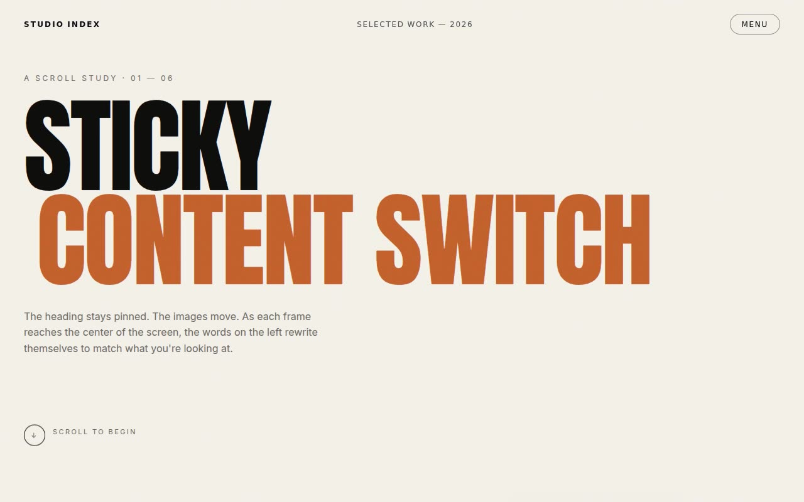

# Sticky Content Switch — Scroll-Driven Editorial Section Template (HTML, CSS, Vanilla JS, Anton, Inter, IntersectionObserver)

[](./demo.mp4)

A two-column scroll-driven editorial section demonstrating the "sticky content switch" pattern: the left column is pinned and vertically centered, holding the active project's text block, while the right column is a tall stack of full-height image panels that scroll past — whenever a new image crosses the vertical center of the viewport, the sticky left-side text swaps to that content with a crossfade and vertical slide. The design uses near-black ink (`#0E0E0C`) on warm paper (`#F4F1EA`) with a burnt-orange accent (`#C4622D`), Anton display face paired with Inter, and a ~4% SVG fractal-noise grain; the core interaction is driven by an IntersectionObserver with `rootMargin` collapsed to a 1px band at center, a second rAF scroll loop applies per-panel parallax scale and grayscale-to-color on the active image, covering six items (Monument, Terrain, Chroma, Circuit, Quiet, Horizon). All fonts and images are vendored locally, and the template honors `prefers-reduced-motion`. Generated with Claude Fable 5.

## Run

This is a static project — open `index.html` in a browser, or serve the folder:

```sh
python3 -m http.server 8000
```

See `prompt.md` for the full build spec; `demo.mp4` shows it in motion.

---

Part of the [Templates](../) collection in the [claude-directory](../../) — an open-source gallery of AI-generated UI built with Claude Fable 5. [Browse the live gallery](https://pulkitxm.com/claude-directory).
