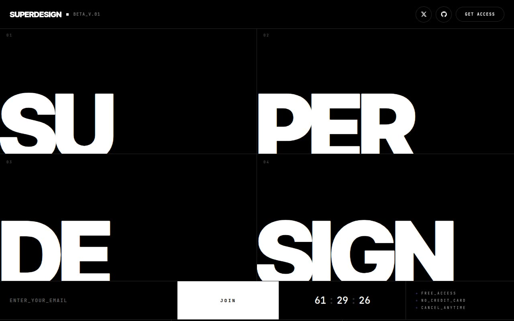

# Superdesign — Architectural Type System (HTML, Inter Tight, JetBrains Mono, Swiss Brutalism)

[](./demo.mp4)

A minimalist monochrome Swiss-brutalist interface where typography is the primary visual element — massive Inter Tight 900 headlines spell out SU / PER / DE / SIGN across a 2×2 viewport grid, divided by 0.5px hairline borders and overlaid with a fractal-noise SVG grain at 5% opacity for tactile depth. A four-column command bar combines an email input, a JOIN button that switches to indigo (`#6366F1`) on hover, a live HH:MM:SS countdown in JetBrains Mono tabular-nums, and stacked underscore-prefixed system labels. Below, a three-card bento feature grid reveals geometric shapes on hover — including a 45°→90° rotating diamond — while keeping everything else at 0px border-radius. No shadows, no gradients; depth comes entirely from hairlines, contrast, and noise grain. Generated with Claude Fable 5.

## Run

This is a static project — open `index.html` in a browser, or serve the folder:

```sh
python3 -m http.server 8000
```

See `prompt.md` for the full build spec; `demo.mp4` shows it in motion.

---

Part of the [Templates](../) collection in the [claude-directory](../../) — an open-source gallery of AI-generated UI built with Claude Fable 5. [Browse the live gallery](https://pulkitxm.com/claude-directory).
