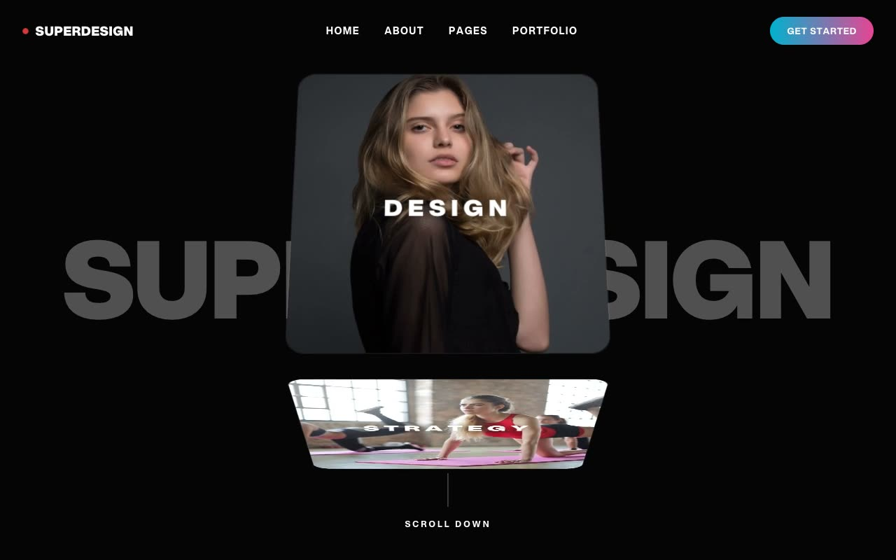

# Superdesign Cinematic Agency — Dark Creative-Agency Landing Page (HTML + CSS + Vanilla JS)

[](./demo.mp4)

An immersive dark-mode creative-agency landing page template with a cinematic editorial design language — 3D spatial depth, a rotating rolodex cube hero, and massive uppercase Aspekta display type on a near-black `#050505` canvas with a cyan-to-pink gradient accent (`#06B6D4`→`#EC4899`). Built for high-impact agency websites and SaaS marketing pages, the template combines a glassmorphism price calculator, a bento case-studies grid, three-tier pricing with a central purple glow, a startups banner, and a massive editorial footer — all as self-contained static HTML with no build step and no remote dependencies. Generated with Claude Fable 5.

## Run

This is a static project — open `index.html` in a browser, or serve the folder:

```sh
python3 -m http.server 8000
```

See `prompt.md` for the full build spec; `demo.mp4` shows it in motion.

---

Part of the [Templates](../) collection in the [claude-directory](../../) — an open-source gallery of AI-generated UI built with Claude Fable 5. [Browse the live gallery](https://pulkitxm.com/claude-directory).
