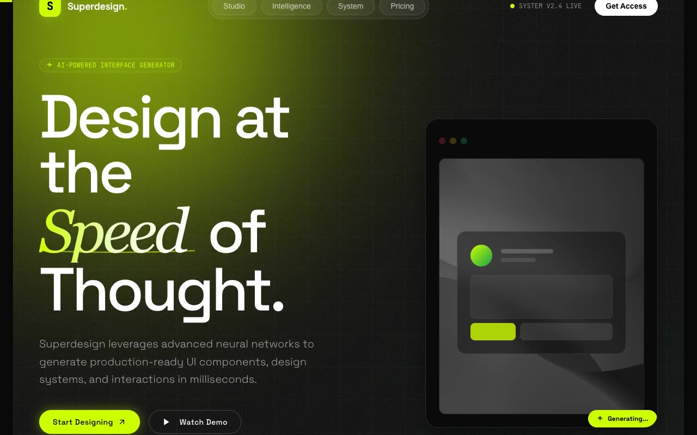

# Superdesign Obsidian & Lime — AI Design Tool Marketing Landing Page (HTML + CSS + JS)

[](./demo.mp4)

A single-page marketing landing site for a fictional AI design tool built in the futuristic "Obsidian & Lime" glassmorphism design system: an obsidian dark base (`#0A0A0A`) with high-vibrancy neon lime accents (`#CCFF00`), tech-industrial typography, and a floating rounded-shell architecture where the entire site lives inside one `2rem`/`3rem`-radius container. Generated with Claude Fable 5.

Type is set in Space Grotesk (headings and body, very tight tracking) and JetBrains Mono (technical labels), with serif italic gradient accent words. Glassmorphism uses ~3% white overlays with 16px+ blur; depth comes from a grainy noise SVG texture, a 60×60px gradient grid pattern, and large blurred radial glow spheres. Top to bottom inside the shell: a scroll-progress bar, a split-grid hero with an interactive glass app-preview mockup, a bento feature section (neural engine, atomic tokens, stat card, global CDN), a high-contrast light methodology section, and a black footer with an oversized lime CTA. Motion is framer-style fade/slide/scale entrances, hover states throughout, and a spring-smoothed scroll-linked progress bar.

## Run

This is a static project — open `index.html` in a browser, or serve the folder:

```sh
python3 -m http.server 8000
```

See `prompt.md` for the full build spec; `demo.mp4` shows it in motion.

---

Part of the [Templates](../) collection in the [claude-directory](../../) — an open-source gallery of AI-generated UI built with Claude Fable 5. [Browse the live gallery](https://pulkitxm.com/claude-directory).
