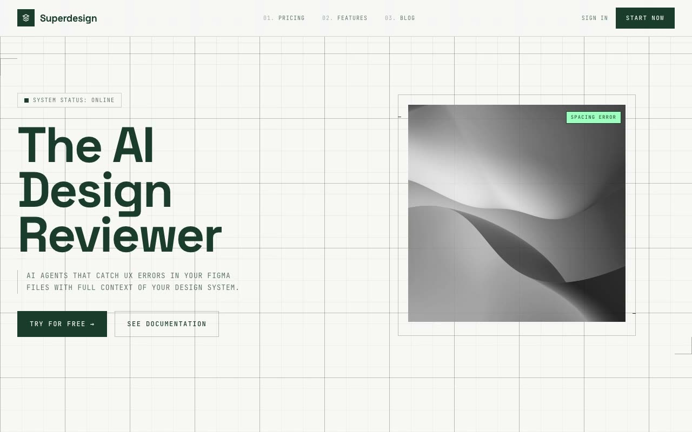

# Superdesign Technical System — AI Design Review Landing Page (HTML + CSS + JS)

[](./demo.mp4)

A landing page for an AI design-review product built on a "Technical Minimalist" design system inspired by technical blueprints and high-end UI wireframes — a flat, 2D prestige-green template with a full-page mosaic grid background, razor-thin 1px hairlines, and no shadows or gradients. Generated with Claude Fable 5.

Type pairs Space Grotesk (display) with JetBrains Mono (all labels, tags, and metadata, uppercase with wide tracking). The palette is Paper `#F7F7F5`, Forest `#1A3C2B`, and Grid `#3A3A38`, plus coral / mint / gold accents. The vertical-scroll structure runs through a fixed nav, a two-column hero with L-shaped hairline corner markers, a trust bar, a 2×2 bento "Feature Set 01" grid with colored left-border accents, a rotating network-topology graph, a three-column monospaced testimonials grid, a "Tell your CTO" CTA form with corner markers, and a footer. The aesthetic is flat and 2D, with fully square (0px-radius) corners; the hero image uses `mix-blend-mode: luminosity` and shifts to full color on hover.

## Run

This is a static project — open `index.html` in a browser, or serve the folder:

```sh
python3 -m http.server 8000
```

See `prompt.md` for the full build spec; `demo.mp4` shows it in motion.

---

Part of the [Templates](../) collection in the [claude-directory](../../) — an open-source gallery of AI-generated UI built with Claude Fable 5. [Browse the live gallery](https://pulkitxm.com/claude-directory).
