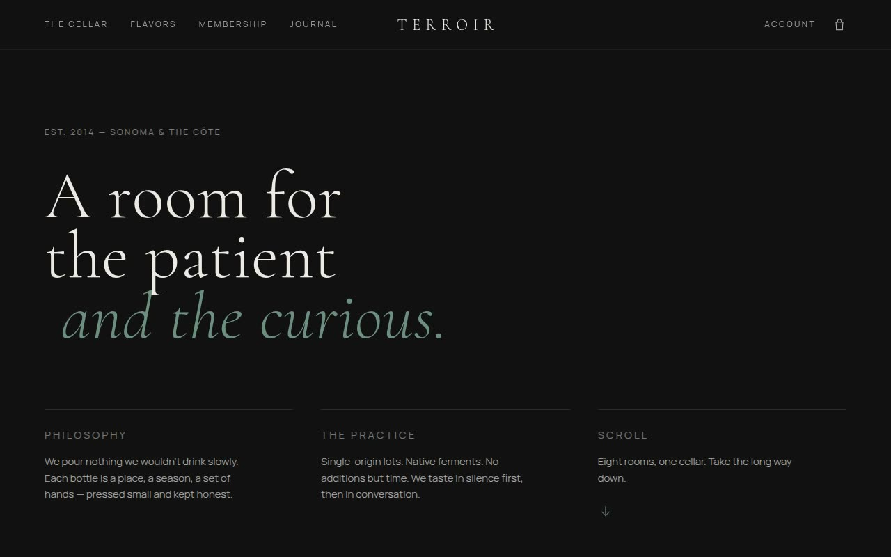

# Terroir Tasting Room — Luxury Boutique Wine Landing Page (HTML + CSS + JS)

[](./demo.mp4)

A luxury boutique wine landing page with a "tasting room" aesthetic built in a dark minimalist editorial style: a `#121212` black canvas, `#EDEAE4` cream text, earthy sage, sienna, and burgundy accents, and a 5% grain overlay for tactile depth — a premium direct-to-consumer wine e-commerce template with storytelling-driven editorial sections and interactive flavor wall cards. Generated with Claude Fable 5.

Typography pairs Cormorant Garamond (light/italic serif, with deep kerning) for headings with Manrope (sans) for functional UI and a DM Mono readout. The 8-section vertical scroll runs through a centered-logo fixed header, an asymmetrical editorial hero, an interactive four-card "flavor wall" (color blocks that fade to reveal images on hover with sliding text), a product spotlight, a case-builder utility, a split-screen membership comparison, a "how it's made" process grid, and a deep footer. Signature interactive components include the flavor-wall grid card (three-layer color/image/text reveal) and a progress capacity indicator (a sage bar tied to a clamped `count/6` case builder that updates live). Section reveals use 800ms ease-out with a 20px Y translate.

## Run

This is a static project — open `index.html` in a browser, or serve the folder:

```sh
python3 -m http.server 8000
```

See `prompt.md` for the full build spec; `demo.mp4` shows it in motion.

---

Part of the [Templates](../) collection in the [claude-directory](../../) — an open-source gallery of AI-generated UI built with Claude Fable 5. [Browse the live gallery](https://pulkitxm.com/claude-directory).
