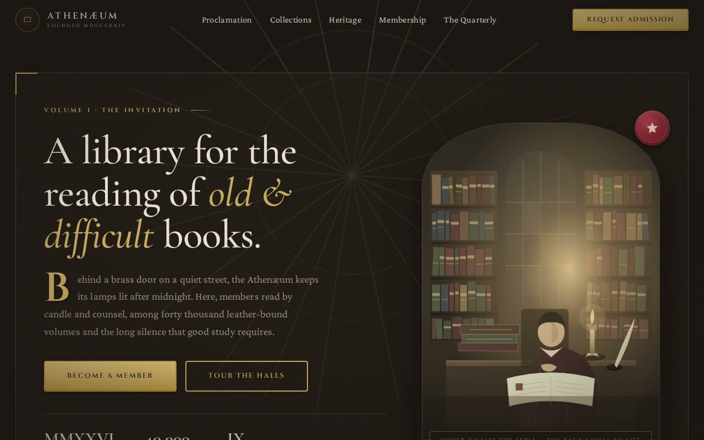

# The Athenæum — Academia / Classical Design System Showcase (HTML + CSS + Vanilla JS)

[](./demo.mp4)

A self-contained showcase landing page that fully expresses the **Academia / Classical** design system: a scholarly, library-at-night experience for a fictional private members' library and manuscript society. This dependency-free static page demonstrates a complete classical UI design system with brass-and-mahogany tokens, arch-topped images, sepia-to-colour hover reveals, wax-seal badges, Roman-numeral section volumes, and ornate dividers — built entirely from CSS custom-property tokens. Generated with Claude Fable 5.

It is not a dark theme with serifs tacked on — it is a physical library
rendered in the browser, built entirely from CSS custom-property tokens
declared once in `:root`.

## The ten sections (Volumes I–X)

1. **Header** — a brass monogram medallion, serif nav with an animated brass
   underline, an engraved *Request Admission* button, and a full-screen mobile
   drawer.
2. **Hero (Volume I)** — a large ornate frame with 40px brass corner brackets,
   a slowly rotating brass sunburst, a drop-cap introduction, an arch-topped
   sepia-to-colour scholar engraving with a crimson wax-seal badge, and
   Roman-numeral hero stats.
3. **Brass marquee** — an infinite strip of Latin mottoes separated by brass
   stars.
4. **Stats (figures)** — four cards with rAF count-ups that scale to brass on
   hover.
5. **Proclamation (Volume II)** — the manifesto / "certificate of excellence"
   section: a *Proclamation* label flanked by brass lines, a centred headline,
   an ornate `❧` divider, drop-cap body copy, and a signed keeper's hand.
6. **Collections (Volume III)** — six discipline cards with carved-medallion
   icons, standalone Roman numerals, and four-corner flourishes.
7. **Heritage (Volume IV)** — a two-column split: an arch-topped great-hall
   engraving beside prose and an illuminated Roman-numeral list.
8. **Course of Study (Volume V)** — an alternating left/right timeline with
   brass rotated-diamond nodes (Terms I–IV), collapsing to a single rail on
   mobile.
9. **Membership (Volume VI)** — three certificate/ledger pricing tiers; the
   featured *Fellow* gets a brass ring and a wax seal.
10. **The Common Room (Volume VII)** — testimonial cards with arch-top portrait
    avatars, quote glyphs and star ratings.
11. **The Quarterly (Volume VIII)** — three arch-top blog cards with
    sepia-to-colour engraving plates.
12. **Enquiries / FAQ (Volume IX)** — an accessible accordion with rotating
    brass chevrons.
13. **Request Admission (Volume X)** — an enquiry form with Cinzel labels,
    brass focus rings and client-side validation, plus the house hours.
14. **Footer** — a four-column directory, a back-to-top monogram and an ornate
    divider.

## Design-system signatures (the "bold factor")

Every mandatory element of the brief is present:

- **Arch-topped images** — every featured image uses the cathedral arch radius
  `40% 40% 0 0 / 20% 20% 0 0`.
- **Sepia-to-colour transitions** — images sit at `sepia(0.6)` and reveal full
  colour over 700ms on hover, with a subtle `scale(1.05)`.
- **Roman-numeral Volume system** — every major section is prefixed *Volume I–X*
  in Cinzel; lists use standalone numerals (I, II, III…).
- **Drop caps** — illuminated Cinzel `::first-letter` caps on the hero,
  proclamation and heritage intros.
- **Corner flourishes** — large 40px brackets on the hero frame, subtle 22px
  brackets on cards.
- **Ornate dividers** — gradient rules (transparent → wood grain → brass) with
  centred `❧ / ✦` glyphs.
- **Wax-seal badges** — radial-gradient crimson seals with a centred star on the
  hero portrait and the featured tier.
- **Brass interactive language** — every button, link, focus ring and hover
  state uses brass `#C9A962` or the brass gradient.
- **Engraved text** — dual text-shadows give buttons a pressed-into-metal look.
- **Texture overlays** — a fixed SVG fractal-noise paper grain (~3.5%) and a
  radial vignette sit above the whole page.

Palette: Deep Mahogany `#1C1714`, Aged Oak `#251E19`, Antique Parchment
`#E8DFD4`, Polished Brass `#C9A962`, Library Crimson `#8B2635`. Type: Cormorant
Garamond (headings) · Crimson Pro (body) · Cinzel (display / labels).

## Tech & assets

Plain, dependency-free **HTML + CSS + vanilla JS** — no build step. Everything
is **vendored locally** so it runs fully offline:

- `assets/fonts/` — Cormorant Garamond, Crimson Pro and Cinzel, self-hosted as
  WOFF2 (latin subset) with a local `fonts.css`.
- `assets/*.svg` — six bespoke, hand-built engraving illustrations (a candlelit
  scholar, the great reading hall, an illuminated manuscript, a celestial /
  armillary plate, a botanical plate) plus a brass favicon. They are full-colour
  so the sepia-to-colour reveal is meaningful.

Interactions (`main.js`): a sticky-header scroll state, an accessible mobile
drawer, a single-open FAQ accordion, `IntersectionObserver` scroll reveals with
staggered delays, `requestAnimationFrame` stat count-ups, a duplicated seamless
marquee, and client-side enquiry-form validation. Honours
`prefers-reduced-motion`.

## Run

It's a static page — serve the folder with any static server:

```bash
# from this directory
python3 -m http.server 5199
# then open http://localhost:5199/
```

## Accessibility

Skip-to-content link, semantic landmarks (`<header>`, `<nav>`, `<main>`,
`<footer>`), a logical heading hierarchy, decorative elements marked
`aria-hidden`, descriptive image alt text, labelled form controls with
`aria-invalid` feedback, `aria-expanded`/`aria-controls` on the accordion and
mobile toggle, an `aria-live` form status, visible 2px brass focus rings,
48px+ touch targets, and a reduced-motion fallback that reveals all content
immediately.

---

Part of the [UI design](../) collection in the [claude-directory](../../) — an open-source gallery of AI-generated UI built with Claude Fable 5. [Browse the live gallery](https://pulkitxm.com/claude-directory).
