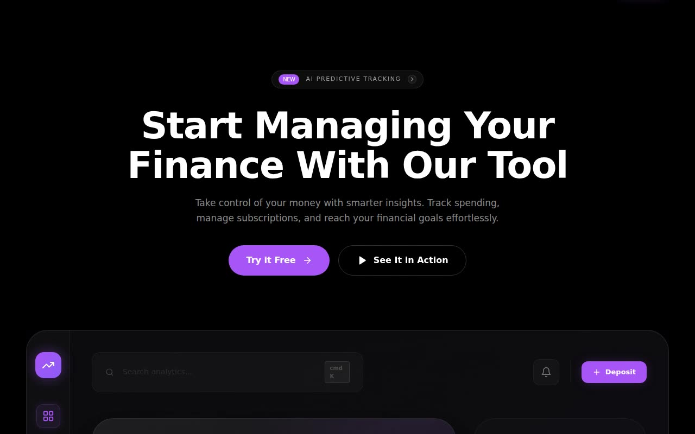

# Velara AI — AI Budget Tracking Landing Page (React + Vite + TypeScript + Tailwind CSS + Framer Motion)

[](./demo.mp4)

A dark, purple-accented fintech landing page for the fictional AI budget-tracking brand **Velara AI**, featuring ten stacked sections including a video-background hero with glass dashboard mockup, animated feature bento grids, a global-transfers map card, infinite testimonial ticker, cosmic-horizon pricing, and an SVG globe-arc footer. Built with React 18, TypeScript, Vite, Tailwind CSS, and Framer Motion, ported from a Next.js App Router template to the standard Vite stack with all component code kept identical. Generated with Claude Fable 5.

A dark, purple-accented (`#A855F7`) AI budget-tracking landing page for the
fictional fintech brand **Velara AI**, assembled from ten numbered template
sections. Part of the [claude-directory](../../README.md).

This experiment applies a multi-file template that was authored for **Next.js +
App Router**. Per the template's own adaptation rules it has been ported to the
repo's standard **Vite + React + TypeScript** stack, and **every component
file's code is kept 100% identical** to the source — only the entry point and
the import alias were adapted (see "Adaptations" below).

## Sections

The page (`src/App.tsx`) stacks the ten components in order:

1. **AI Budget Tracking Hero** — video-background hero, glass nav, NEW badge,
   dual CTAs, and a glass dashboard mockup (animated wave chart, icon sidebar,
   "My Assets" list).
2. **How It Works (02)** — three steps with animated sign-up, financial-goal
   progress bars, and an AI-insight mockup.
3. **Why Choose Us (01)** — six-cell feature grid with looping per-icon
   micro-animations and hover glow.
4. **Features (02)** — bento grid: stacked encryption cards, a smart-alert
   feed, animated monthly-budget bars, and two sparkline mini-cards.
5. **Features (03)** — a global-transfers map card with floating glass
   transfer / live-rate widgets.
6. **Testimonials (01)** — sticky heading beside an infinite dual-column
   testimonial ticker.
7. **Features (06)** — a four-up security band plus an app-download banner with
   a browser-chrome analytics dashboard.
8. **Pricing (01)** — three tiers (Basic / Pro "Popular" / Enterprise) over a
   cosmic-horizon glow with a star field.
9. **FAQ (02)** — an animated accordion (Framer Motion `AnimatePresence`).
10. **Footer (02)** — an SVG globe-arc visual with a traveling light, cycling
    country badges, link columns, social buttons, and a glowing `VELARAAI`
    wordmark.

## Stack

React 18, TypeScript, Vite 5, Tailwind CSS 3, Framer Motion, lucide-react.

## Run

```bash
npm install
npm run dev      # http://localhost:5173
npm run build    # tsc --noEmit + vite build
```

## Adaptations from the source template

The template targeted `/app/page.tsx` with the `@/components/...` alias. The
only adaptations made (all explicitly allowed by the template) are:

- **Entry point:** `src/App.tsx` instead of `app/page.tsx`.
- **Import path:** `@/components/...` → `./components/...` (relative). The
  import list is otherwise byte-identical to the provided `page.tsx`.
- The `"use client";` directives are preserved verbatim (harmless in Vite).

Everything inside the ten component files — JSX, hooks, component names, default
exports, props, `className` values, animations, and logic — is unchanged.

## External assets (note)

The verbatim component code references three external hosts that the build
environment cannot reach and that **must not be changed** (the template
mandates identical code):

- `cdn.jiro.build` — the hero and world-map background videos.
- `i.pravatar.cc` — testimonial and dashboard avatars.
- `fonts.googleapis.com` — the Inter webfont `<link>` tags inside the
  components.

These hosts are not on the environment's network allowlist, so the assets could
not be vendored locally. The page is designed to degrade gracefully without
them: videos sit over black/purple gradient backgrounds, avatars fall back to
tinted circles, and Inter falls back to the system sans stack declared in
`src/index.css`. Layout and interactivity do not depend on these resources.

## Demo

`demo.mp4` is a headless-Chromium walkthrough recorded with the repo's
`scripts/record-demos` recorder.

---

Part of the [UI design](../) collection in the [claude-directory](../../) — an open-source gallery of AI-generated UI built with Claude Fable 5. [Browse the live gallery](https://pulkitxm.com/claude-directory).
