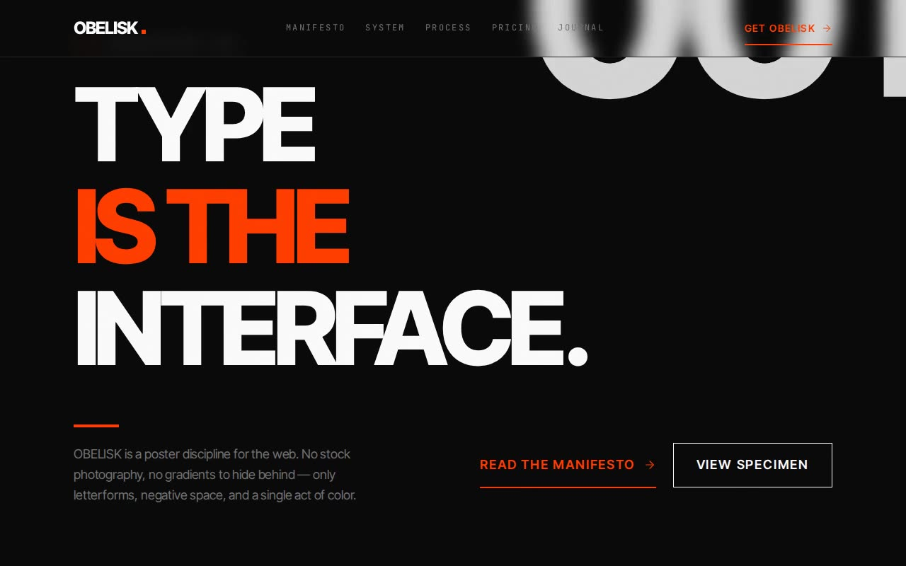

# OBELISK — Bold Typography Design System Showcase (React + Vite + Tailwind CSS + Framer Motion)

[](./demo.mp4)

A single-page editorial showcase built around **OBELISK**, a fictional type-first design system where typography is the entire visual language — a poster design translated to web, with a 13-step type scale, near-black dark palette with vermillion accent (`#FF3D00`), zero border-radius everywhere, and Framer Motion scroll reveals. The page reads like a gallery exhibition or luxury magazine spread, covering hero, marquee, manifesto, stats, feature grid, how-it-works, product detail, pricing, testimonials, FAQ accordion, blog, final CTA, and footer — all driven by centralized CSS-variable design tokens and a token-inversion technique for the inverted CTA section. Generated with Claude Fable 5.

## Sections

- **Hero** — the manifesto opener. The headline is the centerpiece, scaling from
  `text-4xl`/`15vw` on mobile to `~144px` on desktop with one accent line. A huge,
  barely-there `001` numeral drifts behind it on scroll (parallax), the load runs
  a crisp per-line reveal, and the lower row is an asymmetric 5/7 split of lead +
  primary (underline) and secondary (outline) buttons.
- **Marquee** — a full-bleed band of the system's adjectives on one linear loop.
- **Manifesto** — asymmetric 5/7 editorial split with a layered `02` numeral
  (depth via an offset duplicate in border color) and a load-bearing statement.
- **Stats** — mono-numeral band, `1 → 2 → 4` columns, accent units, thin top rules.
- **Features (The System)** — `1 → 2 → 3` collapsed-border grid; lucide icons map
  from each item's `icon` field, sit above the label, and the cell fills with the
  muted surface on hover (no lift, no shadow).
- **Process (How It Works)** — three steps as `number | title | description`; the
  oversized step numerals sit in border color and snap to accent on hover (pure
  150ms color change, no movement).
- **Specimen (Product Detail)** — stacked → 2-column block whose plate uses the
  special depth technique: an absolute accent top bar (`h-1 w-16`) plus layered
  text (a duplicate offset behind in border color).
- **Pricing** — `1 → 2 → 3` tiers; the featured tier is differentiated only by a
  2px accent border and a small accent badge above its content (no bg change).
- **Testimonials** — the only place **Playfair Display** appears: a large italic
  pull quote plus a grid of supporting voices, for elegant serif contrast.
- **FAQ accordion** — full ARIA (`aria-expanded`, `aria-controls`, region role,
  unique ids); panels animate `height: auto` + opacity over 200ms ease-out, the
  toggle swaps Plus ↔ Minus instantly. Keyboard accessible.
- **Journal (Blog)** — `1 → 2 → 3` poster cards; each image sits in an
  `overflow-hidden` frame and scales to `105%` over 500ms on hover (image only).
  Header also carries the **ghost** button variant.
- **Final CTA** — the system's **inverted section**: `.theme-invert` flips the
  tokens so the whole block renders as a warm-white poster while every component
  keeps the same token names. The email field uses the inverted input treatment
  (transparent fill, semi-transparent border, accent focus) and stacks on mobile.
- **Footer** — `2 → 4 → 5` columns, wordmark + blurb + social icons, mono labels.

## The "Bold Factor"

1. **Type as hero** — a 13-step ramp (`xs` 12px → `9xl` 160px) with a 6:1+ gap
   between headline and body.
2. **Three button variants** — primary (accent text + 2px underline scaling
   `100 → 110`), outline (full color inversion on hover), and ghost (muted →
   foreground with a thin 1px underline scaling `0 → 100`).
3. **Sharp edges everywhere** — `border-radius: 0px` globally; depth comes from
   layered type, underlines and full-width rules, never shadows.
4. **Token-driven theming** — a single CSS-variable set, flipped wholesale by
   `.theme-invert` for the Final CTA instead of swapping classes.
5. **Layered-text depth** — duplicate text offset 2px in border color behind the
   bright copy (`.layered-text > .layer`).
6. **Decorative oversized numerals/words** behind content at ~3–4% opacity,
   hidden on mobile to prevent horizontal overflow.
7. **Full-page fractal-noise grain** overlay at ~1.5% opacity (inline SVG
   `feTurbulence`), fixed and non-interactive.
8. **Crisp motion** — one easing curve `cubic-bezier(0.25,0,0,1)` at 150 / 200 /
   500ms; Framer Motion `fadeInUp` with container stagger (80ms, 100ms delay,
   viewport once at 15% / -50px). No bounce.

## Design tokens (centralized)

Tokens live in `tailwind.config.js` (colors wired to CSS variables, the full type
scale, tracking, line-heights, easing, durations) and are defined in
`src/index.css` (`:root` dark theme + `.theme-invert`). Motion tokens live in
`src/motion.ts`.

| Token | Value |
|-------|-------|
| Background (near-black) | `#0A0A0A` |
| Foreground (warm white) | `#FAFAFA` |
| Muted surface | `#1A1A1A` |
| Muted foreground | `#737373` |
| Accent (vermillion) | `#FF3D00` |
| Border / border-hover | `#262626` / `#404040` |
| Card | `#0F0F0F` |
| Border radius | `0px` everywhere |

## Stack

React 18 · TypeScript · Vite 5 · Tailwind CSS v3 (postcss + autoprefixer) ·
Framer Motion · lucide-react (1.5px strokes, used sparingly).

> The design system spec references Tailwind v4 utilities; this build uses the
> repo's idiomatic, verified-working Tailwind v3 setup and implements every
> token / utility faithfully via the Tailwind config + a CSS layer.

## Assets — all vendored locally

- **Fonts** (`assets/fonts/`): Inter Tight (variable), Playfair Display (variable,
  normal + italic) and JetBrains Mono (variable), latin-subset `.woff2`, declared
  via local `@font-face`.
- **Images** (`assets/images/`): four on-brand editorial poster SVGs generated by
  `scripts/gen-posters.mjs` (three journal covers + one type specimen), referenced
  via relative imports so Vite bundles them.

No remote fonts or hotlinked images — the project runs fully offline.

## Run

```bash
npm install
npm run dev        # vite dev server
npm run build      # tsc --noEmit && vite build
npm run preview    # preview the production build
```

## Verify (CLI / headless)

```bash
npm run build
node scripts/verify.mjs
```

`scripts/verify.mjs` boots the production build on a static server, drives a
headless Chromium (via the recorder's Playwright) and asserts 24 checks: the core
design tokens resolve, all three vendored fonts load, every section renders, the
hero headline is ≥ 80px, there is zero border-radius anywhere, the grain overlay
is present, the primary underline is ≥ 2px, the FAQ accordion toggles with correct
ARIA, the Final CTA inverts to the warm-white ground, there is no horizontal
overflow at 1280px or 375px, and there are no console/page errors.

---

Part of the [UI design](../) collection in the [claude-directory](../../) — an open-source gallery of AI-generated UI built with Claude Fable 5. [Browse the live gallery](https://pulkitxm.com/claude-directory).
