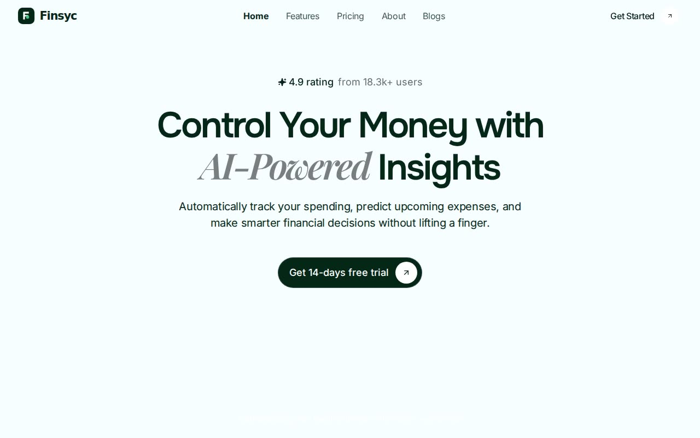

# Finsyc — Finance Management Landing Page (React + Vite + Tailwind CSS + Framer Motion)

[](./demo.mp4)

A full, multi-section **finance-management landing page** for the fictional fintech **Finsyc**, applied verbatim from a 10-component template. A polished fintech UI with animated soft-gradient video backgrounds, Playfair-italic accent typography, count-up metrics, product mockup carousels, and an integrations diagram — built with React, Vite, Tailwind CSS, Framer Motion, and lucide-react. Generated with Claude Fable 5.

## What's inside

Ten composed sections, top to bottom:

1. **Header / Hero** — animated soft-gradient background video, expanding "Get
   Started" pill, a 4.9-rating chip, Playfair-italic accent headline, and an
   infinite brand-logo marquee.
2. **Metrics with logo** — three color-blocked partner cards (Lumassa / Catalyst /
   Naxus) with animated count-up percentages and an expanding "Try for Free" button.
3. **Features** — four large cards, each with a bespoke product-UI illustration
   (donut spend chart, balance-forecast graph, security shield, instant transfer)
   over a tinted video backdrop.
4. **How it works** — a tabbed, four-step flow with crossfading copy and a phone
   mockup that animates between steps.
5. **Why choose us / Benefits** — a sticky intro column beside a scroll-pinned
   benefits list driven by a `useScroll` progress rail.
6. **Metrics + Testimonials** — a character-by-character color-fill headline, a
   count-up metrics band, and a center-snapping, auto-playing testimonial carousel.
7. **Pricing** — three hover-activated tiers with a monthly/yearly toggle and a
   "Save 23%" badge.
8. **Integrations** — an animated central Finsyc seal with dashed connection lines
   and travelling dots wired to eight brand icons.
9. **Blog** — a two-card latest-posts grid.
10. **CTA + Footer** — dual CTAs, a subscribe box, link columns, and a giant rising
    "Finsyc" wordmark.

## Assets

This project is **fully self-contained and runs offline**. The original template
referenced remote assets on `cdn.jiro.build` and `images.unsplash.com`, which are
hotlink-protected / unreachable. All assets are therefore **vendored locally** under
`assets/` and referenced by relative path:

- **Fonts** — Inter, Onest, Playfair Display (italic) `.woff2`, downloaded from
  Google Fonts and declared via `@font-face` in `src/index.css`.
- **SVG art** — Finsyc logo + mark, five partner wordmarks, four feature-UI
  mockups, a phone "process" mockup, and eight integration icons (hand-authored).
- **Raster** — two blog covers and five testimonial avatars (`.jpg`).
- **Video** — `assets/video/finsyc-bg.mp4`, a looping soft-gradient background
  generated locally with ffmpeg.

## Run it

```bash
npm install
npm run dev      # http://localhost:5173
npm run build    # tsc --noEmit && vite build
npm run preview
```

## Verify (headless, CLI-only)

`scripts/verify.mjs` drives a headless Chromium (Playwright) against a running dev
server and asserts: every section heading renders, every `` decodes, the hero
`<video>` mounts, the page is full-height, and there are no JS errors or failed
local assets.

```bash
# with a Playwright Chromium available on PLAYWRIGHT_BROWSERS_PATH
node scripts/verify.mjs --url http://localhost:5199/
```

## Demo

[`demo.mp4`](./demo.mp4) is a headless scroll-through recorded with the repo's
`scripts/record-demos` recorder.

---

Part of the [UI design](../) collection in the [claude-directory](../../) — an open-source gallery of AI-generated UI built with Claude Fable 5. [Browse the live gallery](https://pulkitxm.com/claude-directory).
