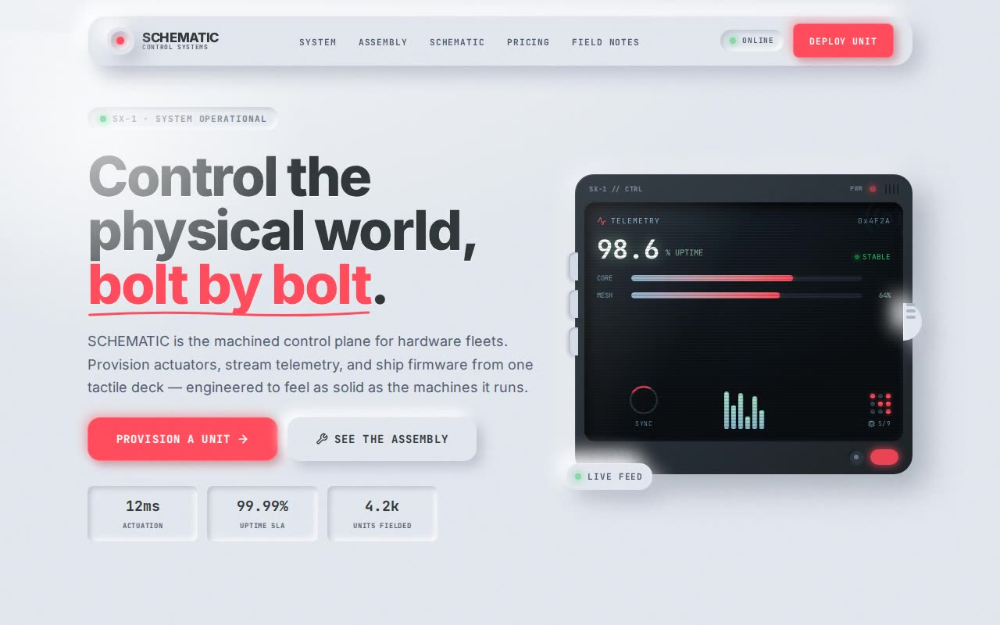

# SCHEMATIC — Industrial Skeuomorphism Landing Page (React, TypeScript, Tailwind CSS v4, Framer Motion)

[](./demo.mp4)

A full landing-page showcase for the Industrial Skeuomorphism design system — SCHEMATIC is a fictional machined control plane for hardware fleets, and every UI element is built to feel like the machines it runs: matte-plastic neumorphic chassis, dual-shadow depth (`8px 8px 16px #babecc, -8px -8px 16px #ffffff`), safety-orange interactive controls, and manufacturing details everywhere including corner screws, vent slots, LED status lamps, CRT scanlines, push pins, masking tape, and punched price-tag holes. The all-CSS hero device mockup features a carbon-fibre bezel, recessed scanline screen, side buttons, a tactile knob, a power LED, and a live abstract dashboard. Staggered Framer Motion entrances use the mechanical easing curve `cubic-bezier(0.175, 0.885, 0.32, 1.275)`, and a `prefers-reduced-motion` fallback freezes all loops. Fonts (Inter + JetBrains Mono), noise textures, carbon-fibre patterns, and schematic illustrations are all vendored locally — no runtime CDN calls. Generated with Claude Fable 5.

## Highlights

- **Centralized design tokens** — every colour, shadow, radius and font lives
  once in `src/index.css` (Tailwind v4 `@theme` + `:root` shadow variables) and
  is consumed via utilities (`bg-chassis`, `shadow-[var(--shadow-card)]`, …).
- **Reusable, accessible primitives** — `Button` (physical-key press inversion),
  `Panel` (bolted module with screws/vents/hover-lift), `Input` (recessed data
  slot with LED-glow focus), `Led`, `Badge`, `IconHousing`, `SectionHeading`.
- **All-CSS hero "device"** — outer carbon-fibre bezel, recessed scanline screen,
  side buttons, a tactile knob, a power LED, and a live abstract dashboard
  (telemetry readout, status bars, EQ, spinner, node grid).
- **Signature sections** — dark count-up stats strip, bolted feature modules,
  a How-It-Works row joined by a cylindrical pipe connector, a blueprint product
  showcase with grayscale→colour schematic, punched-hole pricing, push-pinned
  field-note testimonials, an ARIA accordion FAQ, and a radar-sweep CTA.
- **Fully responsive** — the physical metaphor persists from mobile to desktop;
  asymmetric hero, hamburger drawer, hidden-on-mobile pipe, ≥48px touch targets.
- **Self-contained / offline** — Inter + JetBrains Mono, the noise & carbon-fibre
  textures, the schematic illustration and operator avatars are all vendored
  locally under `public/`. No runtime CDN calls.
- **Motion** — Framer Motion (`motion/react`) staggered entrances on the
  mechanical easing curve `cubic-bezier(0.175, 0.885, 0.32, 1.275)`, plus a
  `prefers-reduced-motion` fallback.

## Run

```bash
npm install
npm run dev        # http://localhost:5173
npm run build      # type-check (tsc) + production build
npm run preview    # serve the build on http://localhost:4173
```

## Verify (headless, CLI-only)

`scripts/verify.mjs` is a Playwright script that asserts the design-system
contract: neumorphic dual-shadows present, self-hosted fonts rendered, every
section + the device mockup, the signature elements (screws, vents, scanlines,
carbon fibre, blueprint grid, radar sweep, pipe, glowing LEDs), tactile button
press inversion, input focus glow, FAQ ARIA toggling, accessibility basics, and
responsive behaviour — with zero console errors.

```bash
npm run build
npm run preview &                 # serve on :4173
node scripts/verify.mjs http://localhost:4173
```

## Stack

React 18 · TypeScript · Vite 6 · Tailwind CSS v4 · Motion (Framer Motion) ·
lucide-react.

---

Part of the [UI design](../) collection in the [claude-directory](../../) — an open-source gallery of AI-generated UI built with Claude Fable 5. [Browse the live gallery](https://pulkitxm.com/claude-directory).
