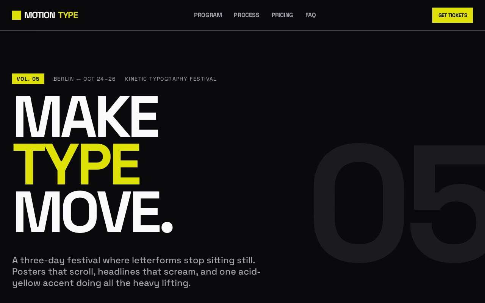

# Kinetic Typography Poster — Brutalist Motion Design Festival Page (React, Framer Motion, Tailwind CSS v4)

[](./demo.mp4)

A kinetic, poster-style landing page for a fictional design festival ("MotionType"), built end to end as a reference implementation of the Kinetic Typography design system: high-energy brutalism meets kinetic poster design, with viewport-width headlines, infinite marquees, hard color inversions, and scroll-triggered transforms. Typography is the entire visual structure — motion is the rhythm, and a single acid-yellow accent does all the heavy lifting against near-black and off-white. Generated with Claude Fable 5.

## Signature elements (the "bold factor")

- **Viewport-width typography** — the hero uses `clamp(3rem, 12vw, 14rem)`, so
  the headline fills the screen and scales fluidly (48px at 320w → 173px at
  1440w).
- **Two infinite marquees** — a fast acid-yellow stats band (`speed 80`) and a
  slower testimonials rail (`speed 40`), plus a closing footer ticker. No
  gradient edges; `react-fast-marquee` with `autoFill`.
- **Massive background numbers** — oversized numerals (`05`, `01`, `24`) in
  muted tones sit in the depth layer as graphic shapes, plus per-card numbers in
  the features and process grids.
- **Hard color inversions on hover** — feature cards, process cells, pricing
  tiers and FAQ rows flood acid yellow with black text on hover (clean
  `duration-300` flip, coordinated via `group`).
- **Scroll-triggered transforms** — the hero zooms (scale 1 → 1.2) and fades
  (opacity 1 → 0) on scroll via Framer Motion's `useScroll`; sections "stamp in"
  with a clip-path reveal; feature cards physically stack with `sticky`.
- **Aggressive scale hierarchy** — ~6–10× between the largest display type and
  body copy, not the usual 2×.
- **Brutalist geometry** — sharp `0px` corners, `2px` zinc borders, hairline
  `gap-px` connected grids, no shadows, no gradients.

## Accessibility

- **`prefers-reduced-motion`** is fully honoured: marquees mount a static rail
  instead of the animated library, scroll/entrance transforms are disabled, and
  transitions collapse to instant — layout, contrast and hierarchy are
  unchanged.
- Skip-to-content link, acid focus rings everywhere, ≥44px touch targets, an
  accordion that is fully keyboard-operable with `aria-expanded` /
  `aria-controls` wiring (panel regions stay mounted so the idref never
  dangles), `aria-hidden` decorative numbers, and a titled noise-texture SVG.
- WCAG AAA contrast (off-white on rich black ≈ 15:1, acid on black ≈ 12:1).

## Architecture

Design tokens are centralised in `src/index.css` via Tailwind v4 `@theme`
(`ink`, `bone`, `muted`, `acid`, `line`, the `Space Grotesk` font), so every
component reads from one source of truth. Reusable primitives live in
`src/components/` (`Button`, `KineticMarquee`, `SectionHeading`,
`SectionLabel`, `BackgroundNumber`, `Reveal`, `Noise`); each page section is its
own file in `src/sections/`; copy/data is in `src/content.ts`. The
**Space Grotesk** variable font (weights 300–700) is vendored locally under
`public/fonts/` — the project runs fully offline.

## Run

```bash
npm install
npm run dev       # dev server
npm run build     # type-check + production build
npm run preview   # serve the production build on :4173
npm run verify    # headless Playwright checks against the preview server
```

## Verify

`npm run verify` boots headless Chromium and asserts the design system is
actually present and behaving: tokens resolve, the clamp hero is viewport-scaled
(~12vw), both marquees animate (and use `role="group"`, not the invalid
`role="marquee"`), background numbers tower, cards hard-invert on hover, the
hero transforms on scroll, the accordion toggles via keyboard with resolving
`aria-controls`, the inputs are oversized, and `prefers-reduced-motion` freezes
all motion while keeping the content. 40 checks, all green.

Stack: React 18, TypeScript, Vite, Tailwind CSS v4, Framer Motion,
react-fast-marquee, Space Grotesk (vendored).

---

Part of the [UI design](../) collection in the [claude-directory](../../) — an open-source gallery of AI-generated UI built with Claude Fable 5. [Browse the live gallery](https://pulkitxm.com/claude-directory).
