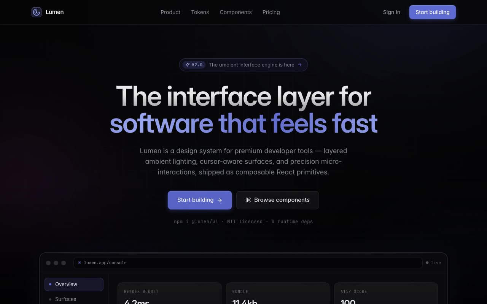

# Lumen — Linear / Modern Design System Showcase (React, Framer Motion, Tailwind CSS)

[](./demo.mp4)

A polished, single-page showcase that fully expresses the Linear / Modern design language for a fictional developer-tools product ("Lumen"): deep near-black canvas, layered ambient lighting, cursor-aware spotlight cards, gradient typography, multi-layer shadows, an asymmetric bento grid, and precision 200–300ms expo-out micro-interactions across hero, features, pricing, and CTA sections. Generated with Claude Fable 5.

## Signature elements (the "bold factor")

- **Animated ambient blobs** — four heavily-blurred gradient "light pools" drift
  slowly behind everything (`AmbientBackground`), over a radial base gradient,
  fractal-noise texture, and a 64px technical grid.
- **Mouse-tracking spotlights** — every `SpotlightCard` renders a 320px radial
  accent glow at the cursor and lifts 4px on hover (expo-out, ~300ms).
- **Gradient typography** — headlines use a white→translucent vertical fill;
  the hero key-phrase uses an animated shimmering indigo gradient.
- **Multi-layer shadows** — cards/CTAs combine border highlight + soft diffuse +
  ambient darkness + accent glow (centralized as `shadow-card`, `shadow-cta`…).
- **Scroll-linked parallax** — hero content fades `1→0`, scales `1→0.95`, and
  translates `0→100px` over the first viewport of scroll.
- **Precision micro-interactions** — 200–300ms expo-out everywhere; nothing
  bounces or overshoots.

## Architecture

Design tokens are centralized in `tailwind.config.js` (colors, radius, the
multi-layer `boxShadow` formulas, the `ease-expo` timing, and keyframes) and in
`src/index.css` (font-face, reusable `.text-grad` / `.eyebrow` / `.bg-grid`
utilities). Components reference those token names rather than one-off values, so
changing the system once propagates everywhere.

Reusable primitives live in `src/components`: `Button` (primary/secondary/ghost),
`SpotlightCard` (default/glass/gradient), `Reveal`/`RevealGroup`/`RevealItem`
(staggered scroll entrances), `SectionHeader`, and the page sections.

## Accessibility

- Off-white text (`#EDEDEF`) on near-black for high contrast; muted text meets AA.
- Prominent accent focus rings on every interactive element; a skip-to-content link.
- `prefers-reduced-motion` is honoured globally (Framer Motion `MotionConfig`
  plus a CSS override) — blobs, parallax, shimmer, and scan-lines fall back to
  static, fully-visible content.
- State never relies on colour alone (icons + labels reinforce the "Online" pill,
  build status, etc.).

## Stack

React 18 · TypeScript · Vite · Tailwind CSS · Framer Motion · Lucide.
Fonts (Inter + JetBrains Mono variable WOFF2) are **vendored locally** in
`public/fonts` — no CDN, fully runnable offline.

## Run

```bash
npm install
npm run dev      # http://localhost:5173
npm run build    # type-check + production build
```

---

Part of the [UI design](../) collection in the [claude-directory](../../) — an open-source gallery of AI-generated UI built with Claude Fable 5. [Browse the live gallery](https://pulkitxm.com/claude-directory).
