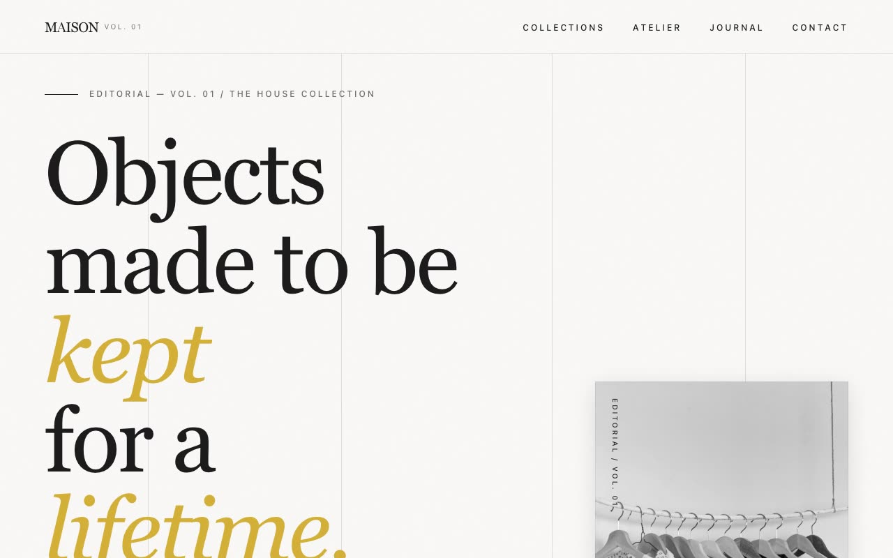

# MAISON — Luxury / Editorial Design System Showcase (React, Tailwind CSS v3, Playfair Display)

[](./demo.mp4)

A standalone showcase page that fully expresses a Luxury / Editorial design system built around the fictional design house MAISON: elegance through restraint, exquisite Playfair Display typography hierarchy, generous negative space, slow cinematic motion at 500–2000ms, intentional asymmetry, grayscale-to-color image reveals, and layered depth through subtle shadows — evoking high-end fashion magazines and luxury brand websites. Generated with Claude Fable 5.

## Sections

- **Hero** — massive Playfair headline (`text-5xl` → `text-9xl`, `leading-[0.9]`)
  with mixed regular/gold-italic words, a decorative overline, a large grayscale
  portrait with a vertical writing-mode edge label, and a gold-sliding primary +
  fill secondary button. Bottom-left, asymmetric.
- **Curated Features** — drop-cap intro paragraph, mixed-italic gold headlines
  (*Curated Excellence*, *The Details*, *The Process*), grayscale → colour image
  reveals, asymmetric 12-col layout with offset column starts.
- **Stats** — dark inverted section, big Playfair numbers, tiny uppercase labels
  (2 cols mobile, 4 desktop).
- **Testimonials** — signature multi-layer hover: left border → gold + padding
  increases, grayscale avatar → colour, author name → gold, stars scale up.
- **FAQ accordion** — full ARIA (`aria-expanded`, `aria-controls`, region role,
  unique ids), question turns gold on open, icon square rotates 90° + border
  turns gold, content fades in with a `fadeIn` keyframe. Keyboard accessible.
- **Blog grid** — portrait `aspect-[4/5]` grayscale → colour cards, deepening
  shadows, decorative `h-px` dividers between metadata, Playfair titles.
- **Footer CTA** — large headline, underline-only email input with italic
  Playfair placeholder + gold focus border, gold-sliding button, stacks on
  mobile. Dark inverted section.

## The "Bold Factor"

1. Vertical writing-mode side labels (`writing-mode: vertical-rl`), desktop only.
2. Four fixed vertical gridlines at `bg-foreground/12`, pointer-events none.
3. Gold sliding primary button (`translate-x-[-100%]` → `0`, `duration-500`,
   `cubic-bezier(0.25,0.46,0.45,0.94)`).
4. Paper-grain SVG `feTurbulence` noise overlay — fixed, ~2%, `z-[60]`.
5. Decorative horizontal lines (`h-px w-8 md:w-12`).
6. Extreme type scale (`text-[10px]` labels paired with `text-9xl` headlines).
7. Drop caps, mixed-italic gold headlines, grayscale-by-default imagery, layered
   soft shadows.

## Design tokens (centralized)

Tokens live in `tailwind.config.js` (`theme.extend.colors`, shadows, easing,
keyframes) and mirrored as CSS variables in `src/index.css`:

| Token | Value |
|-------|-------|
| Background (warm alabaster) | `#F9F8F6` |
| Foreground (rich charcoal) | `#1A1A1A` |
| Muted bg (pale taupe) | `#EBE5DE` |
| Muted fg (warm grey) | `#6C6863` |
| Accent (metallic gold) | `#D4AF37` |
| Border radius | `0px` everywhere |

## Stack

React 18 · TypeScript · Vite 5 · Tailwind CSS v3 (postcss + autoprefixer) ·
lucide-react (thin strokes, used sparingly).

> The design system spec references Tailwind v4; this build uses the repo's
> idiomatic, verified-working Tailwind v3 setup and implements every token /
> utility faithfully via the Tailwind config + a CSS layer.

## Assets — all vendored locally

- **Fonts** (`assets/fonts/`): Playfair Display (variable, normal + italic) and
  Inter (variable), latin-subset `.woff2`, declared via local `@font-face`.
- **Images** (`assets/images/`): 10 portrait editorial photographs (hero,
  features, blog, avatars), referenced via relative imports so Vite bundles them.

No remote fonts or hotlinked images — the project runs fully offline.

## Run

```bash
npm install
npm run dev        # vite dev server
npm run build      # tsc --noEmit && vite build
npm run preview    # preview the production build
```

## Verify (CLI / headless)

```bash
npm run build
npm run preview -- --port 4317 --strictPort   # in one shell
node scripts/verify.mjs                        # in another
```

`scripts/verify.mjs` drives a headless Chromium (via the recorder's Playwright)
and asserts: all sections render, zero console/page errors, the FAQ accordion
toggles with correct ARIA, the gold-button overlay transform changes on hover,
images are grayscale-by-default, and the core design tokens resolve correctly.

---

Part of the [UI design](../) collection in the [claude-directory](../../) — an open-source gallery of AI-generated UI built with Claude Fable 5. [Browse the live gallery](https://pulkitxm.com/claude-directory).
