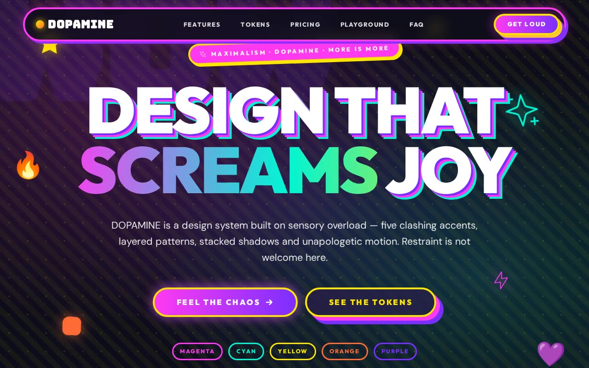

# DOPAMINE — Maximalism / Dopamine Design System Showcase (HTML + CSS + Vanilla JS)

[](./demo.mp4)

A self-contained, living documentation page for a fictional component kit called **DOPAMINE**, demonstrating the Maximalism / Dopamine visual style end to end: five clashing accent colors, pattern-on-pattern layering, multi-layered stacked shadows, massive bleeding typography, and over twenty floating decorative shapes — all stitched together by scrolling marquees. The design principle is unapologetic excess: every pixel sparks joy, empty space is wasted space. Generated with Claude Fable 5.

## What it demonstrates (every "Bold Factor" signature)

- **5-accent systematic rotation** — magenta, cyan, yellow, orange and purple cycle
  through every section and grid; the same color never dominates twice in a row.
- **Pattern-on-pattern layering** — two fixed global patterns (dots + stripes) plus
  1–2 section-specific layers (`.pattern-dots / -stripes / -checker / -mesh`), each at
  low opacity, on every section.
- **Multi-layered shadows** — never a single shadow: soft colored glows combined with
  hard offset stacks that double their distance (8 → 16 → 24px) in clashing accents.
- **Text-shadow stacks** — single / double / triple / mega stacks in 2px increments
  rotating through accents on headlines and card titles.
- **Massive bleeding typography** — oversized words (`WOW`, `YES`, `DNA`, `GO`,
  `PLAY`, `HUH`, `JOY`) stroked / filled at low opacity behind content.
- **Animated gradient text**, **floating decorative shapes** (21 of them), **clashing
  borders**, **broken/offset grids**, **mixed border styles**, and **emoji accents**.
- **Bouncy motion** — float, float-reverse, spin-slow, wiggle, bounce, pulse-glow and
  gradient-shift keep well over a third of elements in continuous, GPU-only motion.

## Accessibility

- **19.5:1 body contrast** — pure white on the deep purple-black; accents are reserved
  for decoration, never body text.
- **Double-ring focus** — every control shows a dashed outline **plus** a layered
  box-shadow ring (≥8px), so focus never relies on color alone.
- **Semantic + ARIA** — one `h1`, ordered headings, `aria-expanded`/region wiring on
  the FAQ with arrow-key roving, labelled inputs, `aria-live` form status, and
  `aria-hidden` on all 21 decorative shapes and 19 pattern overlays.
- **`prefers-reduced-motion`** — all keyframe motion and entrance offsets are disabled
  while every color, border and shadow is preserved (the chaos stays, the motion stops).
- **Mobile keeps the chaos** — grids collapse to one column but patterns, borders,
  rotations and floating shapes all remain; it never simplifies to clean minimalism.

## Stack

- Plain **HTML + CSS + vanilla JavaScript** — no build step, no framework, runs offline.
- All five typefaces vendored locally as `woff2` in `assets/fonts/`: **Outfit** &
  **Unbounded** (headings), **DM Sans** (body), **Bangers** & **Bungee** (display).
- Lucide-style icons inlined as an SVG sprite — no remote icon dependency.
- Every token (5 accents, shadow stacks, pattern recipes, radii, motion timings) is a
  CSS custom property in `:root` — retune the whole page by editing one block.

## Run

It is a static site — open `index.html` directly, or serve the folder:

```bash
python3 -m http.server 5199
# then open http://localhost:5199/
```

## Verify (CLI only)

```bash
node verify.mjs   # headless Chromium checks (desktop 1280 + mobile 390):
                  # structure, fonts loaded, FAQ toggle, stat count-up, form
                  # validation, mobile drawer, focus ring, reduced motion,
                  # no horizontal overflow, zero console / page errors
```

## Files

| File | Role |
|------|------|
| `index.html` | Structure + content + inline icon sprite |
| `assets/styles.css` | The design system: tokens, patterns, shadows, every component |
| `assets/app.js` | Marquee, scroll-reveal, count-up, FAQ, drawer, nav state, CTA form |
| `assets/fonts/*.woff2` | Outfit, Unbounded, DM Sans, Bangers, Bungee — vendored locally |
| `verify.mjs` | Headless verification script |
| `demo.mp4` | Recorded walkthrough |

---

Part of the [UI design](../) collection in the [claude-directory](../../) — an open-source gallery of AI-generated UI built with Claude Fable 5. [Browse the live gallery](https://pulkitxm.com/claude-directory).
