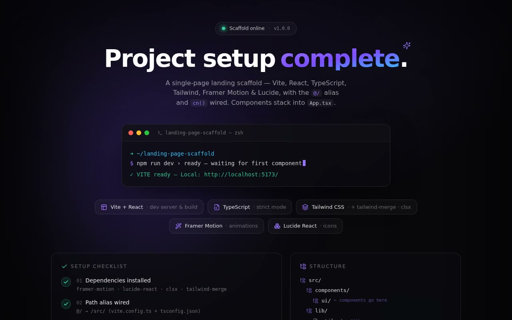

# Scaffold Ready Splash — React + Vite + TypeScript + Tailwind CSS Starter (Framer Motion + Lucide)

[](./demo.mp4)

A from-scratch single-page landing page scaffold built to an exact specification: **Vite + React + TypeScript + Tailwind CSS** pre-wired with `tailwind-merge` / `clsx`, **Framer Motion**, and **Lucide React**, with the `@/` path alias and a `cn()` utility. The app shell ships a polished, self-contained **"Scaffold ready"** splash screen that proves all the wiring is working before the first real component arrives. Generated with Claude Fable 5.

## What's wired (exactly to spec)

- **STEP 1 — Dependencies:** `framer-motion`, `lucide-react`, `clsx`,
  `tailwind-merge` (plus React / Vite / Tailwind / TypeScript dev deps).
- **STEP 2 — Path alias:** `@/` → `/src/` in both `vite.config.ts`
  (`resolve.alias`) and `tsconfig.json` (`baseUrl` + `paths`).
- **STEP 3 — `cn()`:** `src/lib/utils.ts` — `twMerge(clsx(inputs))`.
- **STEP 4 — Tailwind base:** `src/index.css` — `@tailwind base/components/utilities`
  + antialiased body.
- **STEP 5 — Entry point:** `src/main.tsx` — `createRoot` + `<React.StrictMode>`.
- **STEP 6 — App shell:** `src/App.tsx` —
  `<main className="relative min-h-screen flex flex-col">` with the
  `{/* Components will be stacked here */}` slot preserved.

The four STEP 3–5 files and the STEP 2 configs are reproduced **character-for-character**
from the brief; `App.tsx` keeps the exact shell + comment and renders a single
placeholder component in the slot.

## The "Scaffold ready" splash

`src/components/ui/ScaffoldReady.tsx` — a polished, fully self-contained status
screen that doubles as a live wiring check (it exercises the `@/` alias, `cn()`,
Framer Motion, and Lucide):

- **Ambient background** — drifting gradient orbs, a slowly panning technical
  grid (radial-masked), fractal-noise grain, and an inner vignette.
- **Status pill** — a pinging emerald "Scaffold online · v1.0.0" indicator.
- **Gradient headline** — *"Project setup **complete**."* with an indigo→sky
  gradient key-word and a sparkle accent.
- **macOS terminal** — a traffic-light window that **types out**
  `npm run dev › ready — waiting for first component`, with a blinking caret and
  a green `✓ VITE ready` line, plus a sweeping sheen.
- **Stack chips** — Vite + React · TypeScript · Tailwind CSS · Framer Motion ·
  Lucide React, each with a Lucide icon and hover accent.
- **Setup checklist** — the six STEP items, revealed in sequence when scrolled
  into view (`useInView`), each ticked.
- **File tree** — the `src/` structure with inline hints (`← components go
  here`, `cn()`, `stack`).
- **Drop target** — a dashed "Drop your first component here" card with a
  spinning dashed ring, pointing at `src/components/ui/`.

Everything honors **`prefers-reduced-motion`**: the typewriter resolves
instantly and every looping/decorative animation (orbs, grid pan, ping, sheen,
spin) is disabled, while all content stays fully visible.

## Run it

```bash
npm install
npm run dev        # http://localhost:5173
npm run build      # tsc -b && vite build  (type-checked production build)
```

## Stack

React 18, TypeScript, Vite 5, Tailwind CSS v3, Framer Motion 11, Lucide React,
clsx, tailwind-merge.

## Verification

- `tsc -b` / `npm run build` — clean type-check + production build (1936 modules).
- Headless Chromium (Playwright, CLI-driven) — confirmed the app mounts, the
  `<main>` class matches the spec, the headline / 6-step checklist / stack chips
  / file tree / drop target all render, the terminal types its "ready" line, and
  there are **zero** console errors or failed requests, in both the default and
  `prefers-reduced-motion: reduce` paths.
- `demo.mp4` — recorded with the repo's `scripts/record-demos/record-one.sh`.

Fully self-contained and offline: no remote assets, fonts, or CDNs.

---

Part of the [UI design](../) collection in the [claude-directory](../../) — an open-source gallery of AI-generated UI built with Claude Fable 5. [Browse the live gallery](https://pulkitxm.com/claude-directory).
